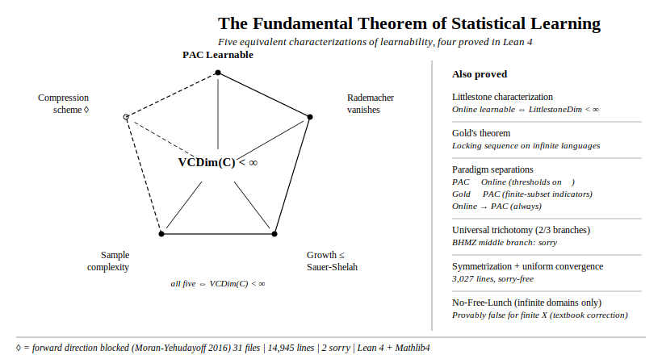
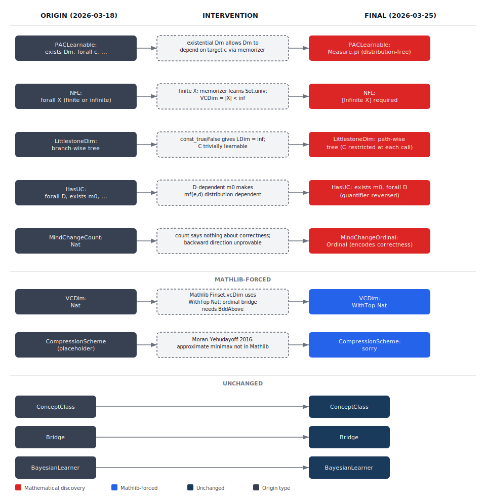
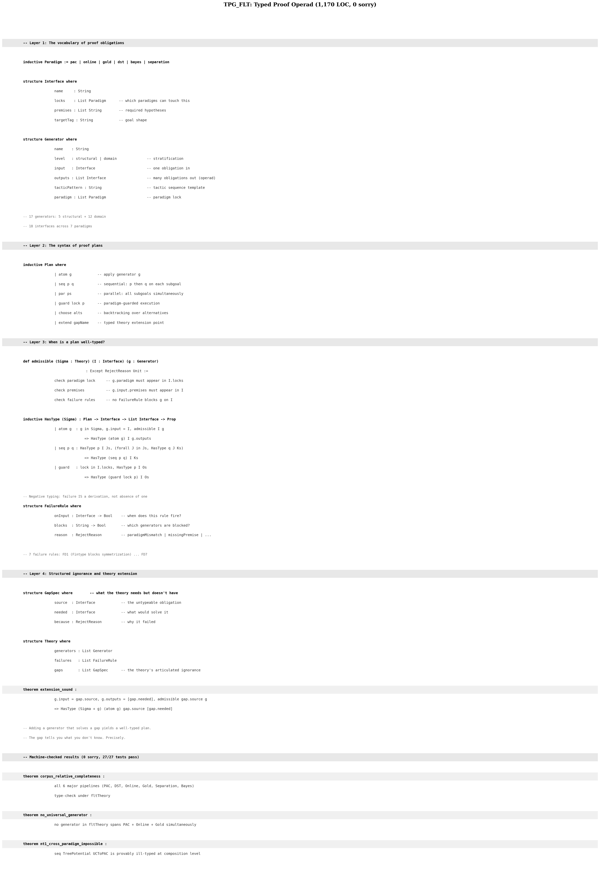
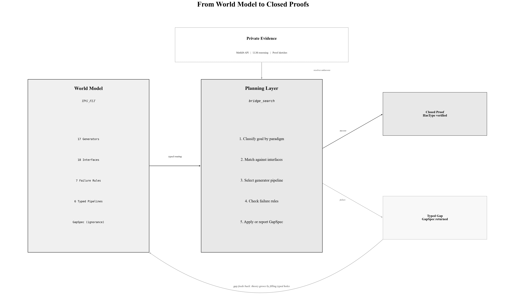
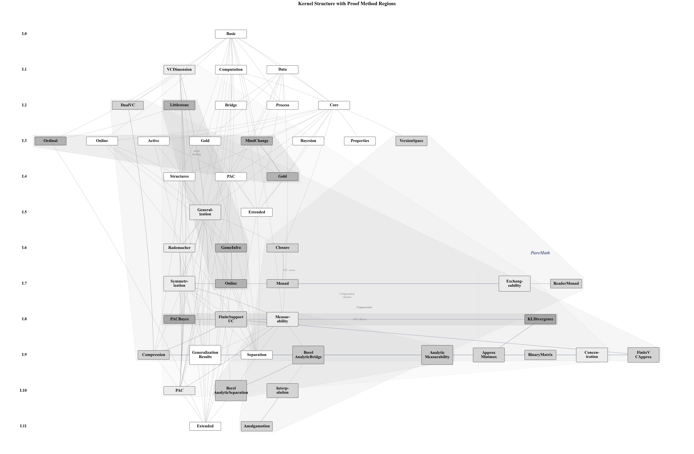
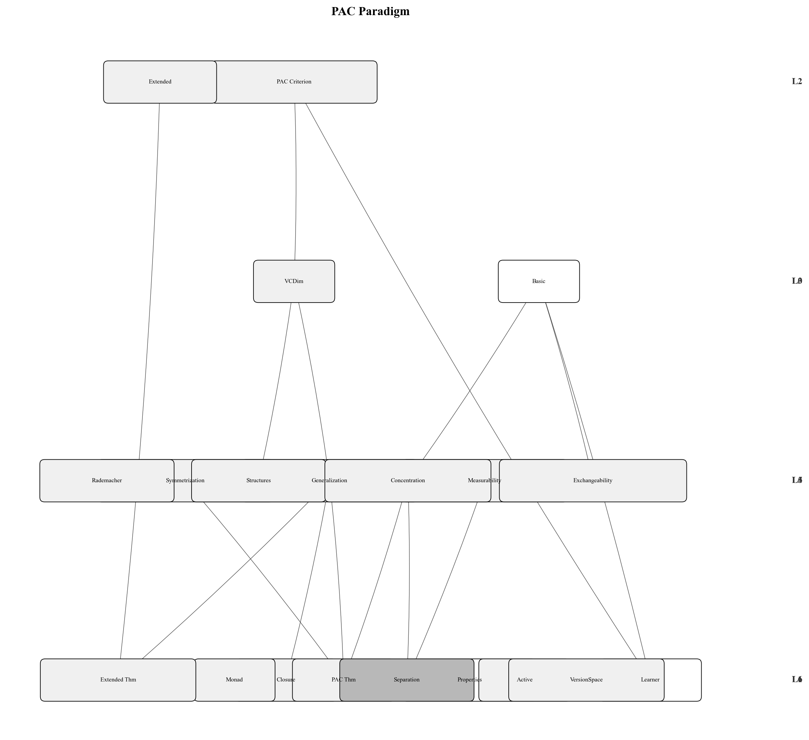
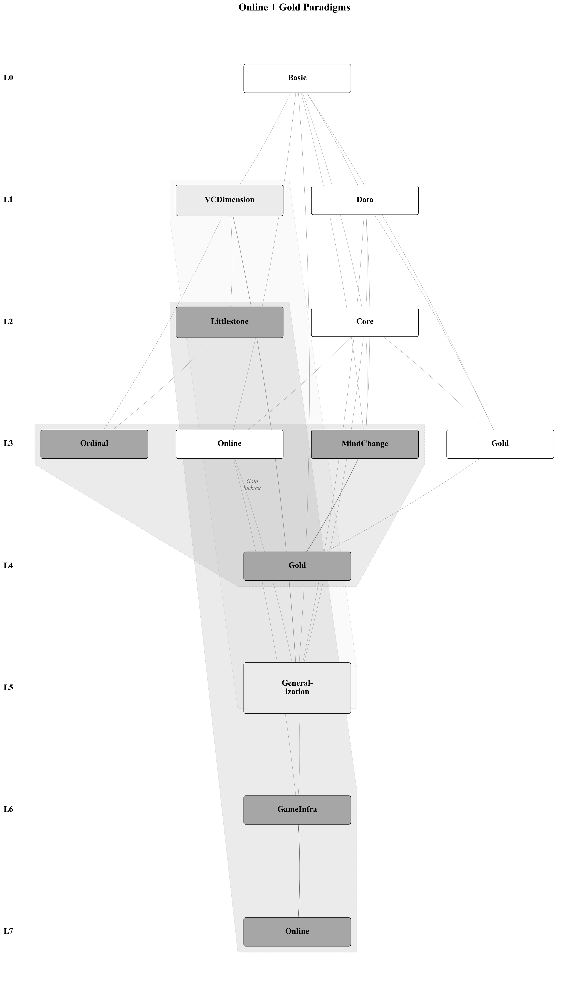
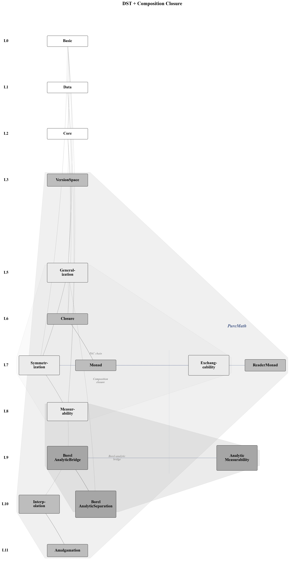

# Formal(ized) Learning Theory

[](https://github.com/Zetetic-Dhruv/formal-learning-theory-kernel/actions/workflows/ci.yml) 

**Live docs:** <https://zetetic-dhruv.github.io/formal-learning-theory-kernel/>

| Lean | Mathlib | LOC | Theorems | Files | Sorry |
|------|---------|-----|----------|-------|-------|
| `v4.29.0-rc6` | [`fde0cc5`](https://github.com/leanprover-community/mathlib4/commit/fde0cc508f5375f278f515cb2f50a34a545a4c5c) | 21,522 | 354 | 53 | **0** |

<p align="center">
  
</p>

A 42-node typed premise scoped human-guided, AI-driven proof search across three learning paradigms. The search produced 354 machine-checked theorems in 21,522 lines of Lean 4 with zero sorry. The infrastructure it required produced mathematics the premise did not predict.

The type structure of a field's definitions determines the proof methods available to formalize it. A typed premise, derived before proof search, constrains the search space enough for AI-driven proof discovery to succeed where unconstrained search fails, and the infrastructure forced by the types can generate mathematics the premise did not predict.

| | Contributions |
|---|---|
| **New proof techniques** | 1. Borel parameterization as universal measurability certificate: any concept class parameterized by a StandardBorelSpace with jointly measurable evaluation satisfies WellBehavedVCMeasTarget. Both interpolation and amalgamation are corollaries.<br>2. Bridge between descriptive set theory and statistical learning: Suslin projections and Choquet capacitability applied to uniform convergence bad events.<br>3. Rectangle decomposition for `Nat.find`-based measurable selection, bypassing Kuratowski-Ryll-Nardzewski for countable families.<br>4. Compression via approximate minimax (MWU) instead of exact minimax theorem: constructive iterative proof replacing Moran-Yehudayoff's existential argument. Parameter design (margin 13/24) is original.<br>5. Measure-theory-free compression pipeline: `FinitePMF` + `boolTestExpectation` + `empiricalPMF` prove the compression direction with zero dependency on `MeasureTheory`.<br>6. Universe-polymorphism engineering for compression: `CompressionSchemeWithInfo0` pins the hidden `Info` universe to `Type 0` via `.{u, 0, 0}`, resolving an elaboration obstruction where `Fin T -> Finset (Fin K)` (Type 0) conflicted with `Info : Type u`. |
| **New Mathematics/learning theory** | 1. NullMeasurableSet correction: weakens the hypothesis for the entire fundamental theorem (corrects Krapp-Wirth 2024).<br>2. Borel-analytic separation: the gap between NullMeasurableSet and MeasurableSet is strict, witnessed by a singleton class over an analytic non-Borel set. (The formalized theorem is `KrappWirthSeparationMeasTarget`, the measurable-target variant used in the fundamental theorem pipeline.)<br>3. Interpolation descent: composition of Borel concept classes weakens measurability to NullMeasurable.<br>4. Amalgamation descent: evidential composition also preserves WellBehavedVCMeasTarget; interpolation embeds as a special case (`interpClassFixed_subset_amalgClass`).<br>5. `MeasurableBatchLearner`: new regularity axis isolating joint learner measurability; gates RL policy validity for non-neural architectures.<br>6. MBL closure algebra: closed under Boolean combination, majority vote, piecewise interpolation, and countable selection (with `UniformMeasurableBatchFamily`); forms a monad with definitional laws.<br>7. Version space measurability: first proof that non-neural learners satisfy `MeasurableBatchLearner` via rectangle decomposition. |
| **First formalizations** | 1. Fundamental theorem of statistical learning (5-way equivalence, all conjuncts, sorry-free).<br>2. Compression characterization (VCDim finite implies compression scheme; new proof route via approximate minimax).<br>3. Assouad's dual VC bound (bitstring coding argument: VCDim(M^T) <= 2^(VCDim(M)+1) - 1).<br>4. Approximate minimax via multiplicative weights update (field-independent, Mathlib-contributable).<br>5. Choquet capacitability theorem (Kechris 30.13; 416 lines, Mathlib-contributable).<br>6. Analytic measurability bridge (analytic sets are NullMeasurableSet; 110 lines, Mathlib-contributable).<br>7. PAC-Bayes bound (McAllester; first frequentist-Bayesian bridge in Lean 4).<br>8. Littlestone characterization with corrected path-wise tree definition.<br>9. Gold's theorem and mind change characterization.<br>10. PAC not implies Online (threshold class on N, constructive witness).<br>11. Gold not implies PAC (finite-subset indicators, constructive witness).<br>12. Online implies PAC (unconditional).<br>13. Three-paradigm separation: PAC not implies Online, Gold not implies PAC, Online implies PAC; no proof infrastructure shared across paradigms.<br>14. Borel-analytic separation (WellBehavedVCMeasTarget holds, KrappWirthWellBehaved fails).<br>15. NFL for infinite domains (provably false for finite X).<br>16. Baxter multi-task base case.<br>17. Confidence boosting via 7/12-fraction Chebyshev concentration.<br>18. Measurability typeclass hierarchy with strict separation.<br>19. Finite-support uniform convergence (measure-theory-free).<br>20. Dual VC dimension infrastructure (DualClass, primal-dual shattering bridge). |
| **Proof engineering** | 1. Definition sensitivity taxonomy: wrong definition produces false theorems (Littlestone branchwise), vacuous theorems (PACLearnable existential Dm), or wrong proof architecture (MindChangeOrdinal count-only).<br>2. Measurable inner event metaprogram for non-measurable target events defined by uncountable selection.<br>3. `BorelRouterCode` abstraction for conditional interpolation (attention, routing, transfer).<br>4. Countable enumeration bypass of Kuratowski-Ryll-Nardzewski measurable selection.<br>5. Universe-level pinning (`CompressionSchemeWithInfo0`) resolving Info-type elaboration obstruction.<br>6. `ProperFiniteSupportLearner` factoring: separates "build a good learner" from "turn a good learner into a compression scheme."<br>7. 8 definition repairs forced by formalization (quantifier ordering, realizability guards, cardinality splits, dual direction).<br>8. Premise ablation: 67 to 187 sorrys without structured inquiry framework, 65/67 closed with it. 87.5% vs 0% first-attempt success on articulated unknowns. |

Every theorem in the kernel is fully proved. 

### Prior work

The only prior attempt at formalizing PAC learning theory with VC dimension is Google's [formal-ml](https://github.com/google/formal-ml):

| | formal-ml (Google) | **This kernel** |
|---|---|---|
| Lean | 3 (obsolete) | 4 (v4.29) |
| Sorry | 1 | **0** |
| Scope | Sauer-Shelah + finite-class PAC bounds | 5-way fundamental theorem + 4 separations + compression + PAC-Bayes + measurability hierarchy |
| Status | Incomplete (TODOs for VC-to-PAC connection) | Complete (5/5 conjuncts, 0 sorry) |
| Novel mathematics | None | Borel-analytic separation, MWU compression, MBL monad |

Zhang et al. ([lean-stat-learning-theory](https://github.com/jtristan/lean-stat-learning-theory)) formalize concentration inequalities, covering numbers, and Dudley's entropy integral in Lean 4. Their work is complementary: it covers the analytic infrastructure (sub-Gaussian tails, log-Sobolev, regression rates) that this kernel does not, while this kernel covers the characterization theorems, paradigm separations, and measurability theory that theirs does not. See Section XIV for the full related work landscape.

### Proof difficulty

Characterization theorems are structurally harder to formalize than concentration inequalities or covering number bounds because they cross mathematical domains. The VC characterization connects combinatorics (shattering) to measure theory (product measures) to descriptive set theory (Choquet capacity) in a single proof chain. Each crossing requires dedicated infrastructure.

| Property | This kernel |
|----------|------------|
| Infrastructure ratio | ~65% of LOC is proof infrastructure, not theorem statements |
| Longest proof chain | ~5,800 lines (compression: MWU + Assouad + VC-approx + symmetrization) |
| Domain crossings per characterization theorem | 3-5 (combinatorics x measure theory x DST x game theory) |
| Dead branches (proof routes tried and killed) | 5 (each shaped the kernel architecture) |
| Definition repairs (formalization-forced corrections) | 8 (quantifier ordering, realizability guards, cardinality splits) |
| Measurability obstructions | NullMeasurableSet discovery required 526-line Choquet bridge |

---

## Part I: The Kernel

## I. The Combinatorics-Measure Theory Axis

Each learning paradigm's proof methods are determined by the mathematical domains its definitions cross. In this kernel, PAC learning sits at the intersection of finite combinatorics and infinite measure theory. Online learning sits at the intersection of combinatorics and game theory. Gold-style learning sits within computability and topology. The paradigms connect to each other only through PAC.

This hypothesis predicts: given a new paradigm's type signature, the proof methods it requires are determined before a single theorem is proved. A paradigm whose definitions cross into measure theory will need concentration inequalities and symmetrization. A paradigm whose definitions involve sequential commitment will need game-theoretic potential arguments. A paradigm whose definitions involve convergence on enumerations will need topological arguments. The premise's type choices are a routing table for proof search. The hypothesis would be falsified by a PAC proof requiring no measure theory, an Online proof requiring concentration inequalities, or a direct Online-Gold theorem bypassing PAC.

### The PAC crossing

Every PAC theorem in this kernel crosses from combinatorics to measure theory. The fundamental theorem asserts that PAC learnability (a measure-theoretic property: probability over i.i.d. samples) is equivalent to finite VC dimension (a combinatorial property: the largest shattered set). The proof infrastructure exists to bridge the crossing:

| Step | From | To | Mechanism |
|------|------|----|-----------|
| Sauer-Shelah | VCDim (combinatorial) | Growth function bound (combinatorial) | Counting restricted labelings |
| Symmetrization | Growth function bound | Uniform convergence (measure-theoretic) | Ghost sample + exchangeability |
| Concentration | Uniform convergence | PAC guarantee (measure-theoretic) | Hoeffding via sub-Gaussian MGF |

A paradigm staying within one mathematical domain would not need this infrastructure, which accounts for 56% of this kernel precisely because PAC crosses two domains.

### Online learning: combinatorics and game theory

The Littlestone characterization asserts that online learnability is equivalent to finite Littlestone dimension. Both sides are combinatorial, but the proof method is game-theoretic. The adversary inspects the learner's prediction and plays the opposite label. The Standard Optimal Algorithm (SOA) is a minimax strategy: at each step, predict the label whose version-space branch has higher Littlestone dimension. The version space is the game state. The Littlestone dimension is the game value.

The game-theoretic infrastructure (version space, adversary strategy, SOA, mistake counting) is extracted to `Complexity/GameInfra.lean` (219 lines). No product measures. No concentration inequalities. No sigma-algebras. The proof infrastructure is 690 lines, not 5,000, because no combinatorics-to-measure-theory crossing is needed.

The adversary-learner interaction pattern (sequential commitment, state update, payoff counting) is shared with bandits and chosen-plaintext attacks, suggesting a common game-theoretic abstraction across these settings.

### Gold-style learning: computability and topology

Gold's theorem constructs a locking sequence: an enumeration strategy that forces the learner to commit to a finite concept, then extends the adversarial text to be consistent with the infinite target. This is a computability argument operating on enumerations. The mind change characterization uses topological convergence: the sequence of conjectures must stabilize on a growing prefix of the enumeration, which is convergence in the pointwise topology on function spaces.

Gold-style learning shares neither the combinatorial shattering structure of PAC and Online nor the measure-theoretic machinery of PAC. It is the only paradigm in this kernel that does not share any proof infrastructure with either of the other two, which is why no theorem connects it to Online directly. On countable domains (which Gold's theorem requires via `[Countable X]`), every function is measurable under the discrete sigma-algebra. Measurability is trivially satisfied. The proof difficulty is elsewhere: in the enumeration structure and the convergence argument.

### The hub structure

PAC is the hub. Online connects to PAC through the VC dimension: `online_imp_pac` proves that any online learner with mistake bound M gives a PAC learner. Gold connects to PAC only negatively: `ex_not_implies_pac` proves that Gold-style learnability does not imply PAC learnability. No theorem in the learning theory literature known to us directly connects online learnability and Gold-style identification without routing through PAC. We state this as a hypothesis, not a fact: if a direct Online-Gold theorem exists, the hub structure would change.

| Pair | Relationship | Evidence | Through PAC? |
|------|-------------|----------|-------------|
| PAC / Online | Obstructed: one direction holds, reverse fails | `online_imp_pac`, `pac_not_implies_online` | N/A (direct) |
| PAC / Gold | Obstructed: Gold does not imply PAC | `ex_not_implies_pac` | N/A (direct) |
| Online / Gold | Independent (hypothesis) | No known direct theorem | All paths route through PAC |

### Why the learner types cannot unify

The learner types are incompatible because each characterization theorem quantifies over a structural feature that exists only in its paradigm's signature.

The fundamental theorem requires that sample complexity `mf(ε, δ)` is distribution-free: it must work for all probability measures simultaneously. This measure-theoretic universal quantifier forces the `BatchLearner` signature, where the sample size `m` is a parameter that depends only on `ε` and `δ`, not on the distribution.

The Littlestone characterization requires that the learner commits to a prediction before seeing the label. This temporal commitment is a property of the `OnlineLearner` signature's `predict : State → X → Y`: the output depends on state accumulated from past rounds, not on the current round's label.

Gold's theorem requires that the learner stabilizes on a growing enumeration prefix. This convergence property is a property of the `GoldLearner` signature's `List (X × Y) → Concept X Y`: the output depends on the full history, and the theorem's conclusion is that the output eventually stops changing.

A parent type that erases the sample size parameter, the temporal commitment, or the growing prefix would erase the mathematical property that the corresponding theorem quantifies over. The type incompatibility is entailed by the theorems.

### What this predicts

If a new learning paradigm is formalized, its proof methods will be determined by which mathematical domains its definitions cross.

A paradigm crossing combinatorics and information theory (e.g., compression-based learning) will need information-theoretic proof infrastructure but may share the combinatorial side with PAC. A paradigm crossing measure theory and game theory (e.g., stochastic online learning) will need tools from both PAC and Online. A paradigm staying within a single domain will require proportionally less proof infrastructure.

For AI-driven proof search: an agent that reads the goal's type signature before choosing tactics can restrict its search space to the paradigm-appropriate methods. Goals mentioning `MeasureTheory.Measure` route to the PAC tactic library. Goals mentioning sequential state route to the Online tactic library. Goals mentioning enumerations and convergence route to the Gold tactic library. The premise is a routing table.

---

## II. Characterization Theorems

A characterization theorem asserts that two objects from different mathematical domains are equivalent. The theorem's difficulty is proportional to the distance between the domains it bridges.

### The equivalence landscape

| Theorem | Object A (structural) | Object B (algorithmic) | Domains bridged |
|---------|----------------------|----------------------|-----------------|
| Fundamental theorem | VCDim(C) < ∞ | PACLearnable(C): `select hypothesis minimizing empirical error over C` | Combinatorics ↔ Measure theory |
| Littlestone char. | LittlestoneDim(C) < ∞ | OnlineLearnable(C): `predict majority label in version space V` | Combinatorics ↔ Game theory |
| Mind change char. | MindChangeOrdinal < ω | EXLearnable(C): `conjecture first h in C consistent with prefix` | Ordinal arithmetic ↔ Computability |
| PAC-Bayes | KL(Q ‖ P) penalty | Gibbs error bound: `classify via h sampled from posterior Q` | Information theory ↔ Combinatorics × Measure theory |

Each row connects a structural object (a dimension, a divergence) to an algorithmic object (a learner, a bound). The type signatures of A and B live in different mathematical domains. The proof infrastructure required to bridge them is determined by the distance between those domains.

### The asymmetry hypothesis

**In biconditional characterization theorems where both directions are proved, the constructive direction (structural → algorithmic: "build a learner from a bound") requires more proof infrastructure than the non-constructive direction (algorithmic → structural: "if a learner exists, derive the bound").**

| Theorem | Forward (structural → algorithmic) | Backward (algorithmic → structural) | Ratio |
|---------|-----------------------------------|-------------------------------------|-------|
| Fundamental theorem | ERM via symmetrization, 3,027 lines | Contrapositive + counting, ~200 lines | 15:1 |
| Littlestone char. | SOA via version space potential, ~400 lines | Adversary construction, ~100 lines | 4:1 |

The pattern: building the algorithm from the structural bound is harder than proving the structural bound from the algorithm's existence. The 15:1 ratio in the fundamental theorem reflects the combinatorics-to-measure-theory crossing from Section I: the symmetrization infrastructure exists because the constructive direction must bridge from a combinatorial bound to a measure-theoretic guarantee. The 4:1 ratio in Littlestone is smaller because both directions stay within combinatorics and game theory.

This predicts that for any new characterization theorem in this kernel, the constructive direction will dominate the proof burden.

PAC-Bayes is a one-directional bound (prior + posterior + data → generalization guarantee), not a biconditional. The asymmetry hypothesis does not apply. PAC-Bayes exhibits a different asymmetry: pointwise-to-uniform (per-hypothesis Hoeffding is straightforward; uniformizing over all hypotheses via Jensen requires the KL machinery).

### The fundamental theorem

The central result, stated as `fundamental_theorem` in `Theorem/PAC.lean` (under `[MeasurableConceptClass X C]`):

> **Theorem** (5-way equivalence). *For a concept class C over a measurable space X, the following are equivalent:*
>
> 1. *C is PAC-learnable*
> 2. *C admits a finite compression scheme*
> 3. *The Rademacher complexity of C vanishes uniformly*
> 4. *The sample complexity of C is finitely bounded (with quantitative sandwich)*
> 5. *The growth function of C is bounded by Sauer-Shelah*
>
> *and all five are equivalent to* VCDim(C) < infinity.

All five equivalences are proved. The compression characterization (finite VCDim implies compression scheme exists) uses a different proof route from Moran-Yehudayoff (2016): approximate minimax via multiplicative weights update replaces the exact minimax theorem entirely. The parameter analysis (margin 13/24 > 1/2 from slack budget 1/12 + 1/24 + 1/8) is original to this formalization.

The constructive direction (VCDim → PAC) produces an explicit ERM learner and routes through 3,027 lines of symmetrization infrastructure to establish uniform convergence. The non-constructive direction (PAC → VCDim) proves the contrapositive: infinite VCDim implies a hard distribution exists. The proof is ~200 lines. The 15:1 ratio is the largest in the kernel and reflects the combinatorics-to-measure-theory crossing from Section I: the symmetrization infrastructure exists because the constructive direction must bridge from a combinatorial bound to a measure-theoretic guarantee.

### The Littlestone characterization

Online learnability is equivalent to finite Littlestone dimension. The forward direction constructs the SOA (Standard Optimal Algorithm), a minimax strategy over version spaces: ~400 lines. The backward direction constructs an adversary that forces mistakes along a shattered tree: ~100 lines. The 4:1 ratio is smaller than the fundamental theorem's 15:1 because both directions stay within combinatorics and game theory. No domain crossing is needed.

### Gold's theorem and definition as proof technique

The mind change characterization asserts: a concept class is EX-learnable if and only if every text presentation has finite mind change ordinal.

The definition of `MindChangeOrdinal` encodes the forward direction:

```
MindChangeOrdinal X L c T :=
  if change_set.Finite then
    if ∃ t₀, ∀ t ≥ t₀, L.conjecture (T.prefix t) = c then
      change_set.toFinset.card    -- finite ordinal: converged correctly
    else
      omega                       -- omega: converged to wrong concept or did not converge
  else
    omega                         -- omega: infinitely many changes
```

The return type carries the convergence proof: a finite ordinal means the learner both converged AND converged correctly. The backward direction of the characterization (EX → finite ordinal) requires showing the change set is finite and the limit is correct: ~30 lines. The forward direction (finite ordinal → EX) is a definitional consequence: if the ordinal is finite, the definition's branching structure already guarantees correct convergence.

The mind change characterization does not participate in the asymmetry hypothesis because the forward direction is not proved but defined. It is an instance of a different phenomenon: definition choice determines where proof work lives. The constructive content (encoding correctness in the return type) is a design decision, not a proof obligation.

Gold's theorem itself (`gold_theorem` in `Theorem/Gold.lean`) proves that no learner can identify in the limit a concept class containing all finite subsets plus an infinite set. The proof constructs a locking sequence: an enumeration strategy that forces the learner to commit to a finite concept, then extends the adversarial text to be consistent with the infinite target. The locking sequence is a paradigm-specific proof technique: it exploits the enumeration structure of text presentations, which exists only in the Gold paradigm. It cannot be applied to PAC (no enumeration) or Online (no convergence requirement).

### PAC-Bayes: the frequentist-Bayesian bridge

McAllester's PAC-Bayes bound connects three mathematical domains. PAC learning is itself the intersection of combinatorics and measure theory (Section I). PAC-Bayes adds information theory to this intersection:

| Domain | Object | Role in the bound |
|--------|--------|-------------------|
| Information theory | KL divergence KL(Q ‖ P) | Complexity penalty for the posterior |
| Measure theory | Gibbs posterior Q over hypotheses | The distribution whose expected error is bounded |
| Combinatorics | Finite hypothesis class H | The space over which prior and posterior are defined |

The proof chains through three steps: per-hypothesis Hoeffding with prior-weighted tail (`pac_bayes_per_hypothesis`), simultaneous bound via union bound (`pac_bayes_all_hypotheses`), and Jensen's inequality over the posterior (`pac_bayes_finite`). The pure mathematical infrastructure (KL divergence, finite PMFs, expected values) is extracted to `PureMath/KLDivergence.lean`.

In the hub structure established in Section I, PAC is the hub through which all paradigms connect. PAC-Bayes provides evidence: it connects the Bayesian paradigm to PAC not through shared vocabulary (both use `ConceptClass` and `HypothesisSpace`) but through a shared bound. The KL divergence penalty mediates between the Bayesian prior-posterior structure and the PAC generalization guarantee. Without this bound, Bayesian and PAC learning share types but not theorems. PAC-Bayes is the theorem that makes the connection substantive.

---

## III. Separations

A separation theorem proves that an implication is strict by constructing a witness: a specific mathematical object that satisfies one condition and provably fails the other. The witness is the mathematics. The theorem statement is the label on the witness.

| If... | ...then one expects | Witness | What it exploits | Learning theory |
|-------|--------------------|---------|-----------------|-----------------|
| Shattering dimension = 1 on a linearly ordered domain | Adversarial game value is finite | Threshold functions on N | Monotonicity bounds shattering (pairs cannot be labeled non-monotonically) but does not bound adversarial depth (binary search has no finite stopping point on N) | PAC-learnable but not online-learnable |
| A family admits a pointwise-convergent selector on every countable enumeration | Shattering dimension is finite | Finite-subset indicators on N | Every finite set is realized (shattering is maximal) but the "output everything seen" selector stabilizes on every enumeration (convergence is trivial) | EX-learnable but not PAC-learnable |
| Adversarial game value is M | Shattering dimension ≤ M | (holds unconditionally) | A shattered set of size > M would allow 2^{>M} labelings, contradicting the finite mistake bound | Online-learnable implies PAC-learnable |
| A set is Σ₁¹ (analytic) in a Polish space | The set is Borel | Singleton class over analytic non-Borel A ⊆ R | Suslin projection creates Σ₁¹ sets that are universally measurable but exit the Borel σ-algebra | WellBehavedVC holds but KrappWirth fails |

### PAC does not imply Online

<!-- FIGURE: threshold_separation.svg
     Style: black/white, Times New Roman, old school academic
     Left panel: Number line (N). Step function showing threshold (· ≤ n).
     Mark a singleton {k} as shattered: threshold at k vs k-1 separates it.
     Mark a pair {a,b} with a < b: labeling (false, true) impossible with monotone function.
     Right panel: Binary search tree. Root queries midpoint m.
     Left child: learner predicted true, adversary reveals false, threshold moves left.
     Right child: learner predicted false, adversary reveals true, threshold moves right.
     Tree grows to arbitrary depth. Each edge labeled with one mistake.
     Caption: "VCDim = 1, LittlestoneDim = infinity. Monotonicity helps sampling, not adversaries."
-->

Consider the threshold class on the natural numbers: `C = {(· ≤ n) | n : Nat}`. Every threshold function is monotone. VC dimension is 1: any singleton {k} is shattered (the threshold at k vs the threshold at k-1 separates it), but no pair {a, b} with a < b is shattered (the labeling "a false, b true" requires a non-monotone function).

Littlestone dimension is infinite. An adversary plays the following game: query the midpoint of the current interval. Whatever the learner predicts, the adversary reveals the opposite. The threshold moves to whichever half the learner got wrong. This binary search forces one mistake per round at every depth. The adversary strategy constructs a shattered tree of arbitrary depth by induction.

VCDim = 1, LittlestoneDim = ∞. The class is PAC-learnable but not online-learnable. The separation exploits the gap between statistical sampling (where monotonicity helps) and adversarial sequencing (where monotonicity is irrelevant because the adversary adapts).

### Gold does not imply PAC

<!-- FIGURE: gold_separation.svg
     Style: black/white, Times New Roman, old school academic
     Left panel: Timeline showing Gold learner's conjectures.
     t=1: sees 2, conjectures {2}
     t=2: sees 5, conjectures {2,5}
     t=3: sees 7, conjectures {2,5,7} = target. Stabilizes.
     Arrow labeled "converges" at the stabilization point.
     Right panel: Shattering diagram.
     Set S = {a, b} on number line.
     Four labelings shown as four indicator functions:
     {a,b}, {a}, {b}, {} -- all realized by Finset indicators.
     Label: "Every finite set shattered. VCDim = infinity."
     Caption: "EX-learnable (convergence on enumeration) but not PAC-learnable (VCDim = infinity)."
-->

Consider finite-subset indicators on the natural numbers: `C = {fun x => decide (x ∈ S) | S : Finset Nat}`. The Gold learner outputs "true on everything seen so far." After finitely many observations, every element of the target finite set has appeared, and the learner's conjecture stabilizes. The class is EX-learnable.

Every finite subset of N is shattered: given any S = {a₁, ..., aₖ}, each labeling f : S → Bool is realized by the indicator of {aᵢ | f(aᵢ) = true}. VCDim = ∞. The class is not PAC-learnable.

The separation exploits the gap between convergence on a fixed enumeration (which requires only eventual correctness) and generalization from a random sample (which requires uniform error control over the entire domain). Gold-style learning does not need to generalize. PAC learning does.

### Online implies PAC

The reverse implication holds unconditionally: any online learner with mistake bound M gives a PAC learner with sample complexity polynomial in M, 1/ε, and 1/δ. The proof routes through the generalization bound from finite Littlestone dimension. This is the only non-strict paradigm separation in the kernel.

### The Borel-analytic separation

<!-- FIGURE: borel_analytic_separation.svg
     Style: black/white, Times New Roman, old school academic
     Three panels stacked vertically:

     Top panel: "The witness class"
     Real line R with a shaded region A labeled "A ⊆ R (analytic, non-Borel)".
     Below the line: zeroConcept shown as flat line at y=false.
     Above the line: three spikes at points a₁, a₂, a₃ ∈ A, each labeled singletonConcept(aᵢ).
     Caption: "singletonClassOn(A): every hypothesis is Borel-measurable."

     Middle panel: "The proof chain"
     Flow diagram, left to right:
     Box "Bad event defined by ∃ a ∈ A"
       → arrow labeled "Suslin projection" →
     Box "Analytic (Σ₁¹)"
       → arrow labeled "Choquet capacity" →
     Box "NullMeasurable"
     Below, a separate path:
     Box "Assume Borel"
       → arrow labeled "preimage under x ↦ (a₀, x)" →
     Box "A is Borel"
       → arrow labeled "contradiction" →
     Box "NOT Borel" (crossed out)

     Bottom panel: "The separation"
     Two boxes side by side:
     Left box (solid border): "WellBehavedVC: HOLDS" with "NullMeasurable ✓" below
     Right box (dashed border): "KrappWirth: FAILS" with "not Borel ✗" below
     Gap between them labeled "strict"

     Caption: "The gap between NullMeasurableSet and MeasurableSet is inhabited."
-->

The kernel's measurability condition for uniform convergence (`WellBehavedVC`, requiring `NullMeasurableSet`) is strictly weaker than the condition proposed by Krapp and Wirth (2024), which requires `MeasurableSet` (Borel). The separation is proved by constructing a concept class whose bad event is NullMeasurable but not Borel.

The witness: let A be an analytic non-Borel subset of the reals. Define the singleton class `singletonClassOn(A) = {zeroConcept} ∪ {singletonConcept(a) | a ∈ A}`, where `singletonConcept(a)` returns true only at x = a.

Every hypothesis in this class is Borel-measurable: the zero concept is constant, and each singleton concept is piecewise constant on a measurable singleton. The uniform convergence bad event (the set of ghost sample pairs where some hypothesis in the class has empirical gap ≥ ε/2) reduces to a planar witness event via a preimage calculation.

The planar witness is analytic. It is defined by an existential projection: "there exists a ∈ A such that the training point misses a and the ghost point hits a." The projection of a Borel set through an existential quantifier is analytic by Suslin's theorem (1917). Analytic sets are universally measurable by Choquet's capacitability theorem (1954), which this kernel formalizes from Kechris 30.13.

The planar witness is not Borel. If it were, then the preimage under the constant section x ↦ (a₀, x) would be Borel. But this preimage is A itself, which is not Borel by hypothesis. Contradiction.

Therefore: `WellBehavedVCMeasTarget` holds (the bad event is NullMeasurable via the analytic-to-universally-measurable chain) but `KrappWirthWellBehaved` fails (the bad event is not Borel). The gap between NullMeasurableSet and MeasurableSet is inhabited by a concrete concept class.

The separation is conditional on the existence of an analytic non-Borel subset of the reals, which is provable under standard set-theoretic assumptions. The theorem `exists_measTarget_separation` takes this as a hypothesis.

This separation connects three fields that had not been connected in this way: descriptive set theory (Suslin projections, Choquet capacity), measure theory (NullMeasurableSet vs MeasurableSet), and statistical learning (uniform convergence bad events for concept classes). The proof method is transportable beyond learning theory to any setting where supremum events over Borel-parameterized families arise.

---

## IV. Definition Sensitivity

A definition is not a stylistic choice. In this kernel, three definitions that appeared correct on paper produced, respectively, a false theorem, a vacuous theorem, and a proof whose difficulty was located in the wrong place. Each was detected during formalization. Each was repaired by modifying the definition.

### The taxonomy

| Failure mode | What goes wrong | Example | How to anticipate |
|-------------|----------------|---------|-------------------|
| **False theorem** | The definition admits a counterexample to the intended characterization | Littlestone tree shattering | Check: does the definition's quantifier structure admit more witnesses than the theorem requires? |
| **Vacuous theorem** | The definition makes the theorem trivially true | PACLearnable with existential Dm | Check: can the existentially quantified auxiliary be constructed from the target concept? |
| **Displaced proof** | The definition forces proof work into the wrong location | MindChangeOrdinal without correctness encoding | Check: does the return type encode the properties the theorem's conclusion requires? |

### False theorem: Littlestone tree shattering

The branch-wise definition allows independent witnesses at each branch:

```
isShattered C (.branch x l r) =
  (exists c in C, c x = true and isShattered C l) and
  (exists c in C, c x = false and isShattered C r)
```

Let C = {const_true, const_false}. const_true witnesses every left branch. const_false witnesses every right branch. LittlestoneDim = infinity. But C is online-learnable with 1 mistake: after one observation, the learner knows which constant it faces. The characterization theorem is false under this definition.

The corrected definition restricts C at each recursive call:

```
isShattered C (.branch x l r) =
  (exists c in C, c x = true) and (exists c in C, c x = false) and
  isShattered {c in C | c x = true} l and
  isShattered {c in C | c x = false} r
```

Under the corrected definition, C = {const_true, const_false} gives LittlestoneDim = 1. The characterization theorem holds. The two definitions are different logical formulas: the first quantifies independent witnesses per level, the second restricts to a consistent class along each path.

### Vacuous theorem: PACLearnable with existential Dm

The original definition:

```
exists Dm : Measure (Fin m -> X x Y), [probability conditions] and [PAC guarantee]
```

The existential allows Dm to depend on the target concept c. A memorizer constructs Dm as the point mass encoding c. Every finite concept class is trivially PAC-learnable. The theorem is vacuous.

The corrected definition uses Measure.pi:

```
Measure.pi (fun _ : Fin m => D) { xs | ... }
```

The sample measure is the product of m independent copies of D. The learner cannot see c through the sample distribution. PAC learnability becomes non-trivial.

### Displaced proof: MindChangeOrdinal

The original MindChangeCount returned a natural number: the count of mind changes. The forward direction of the characterization (finite count implies EX-learnable) required a separate proof that the learner converges correctly, not just that it stops changing. The proof was unexpectedly difficult because the definition did not carry the information the theorem needed.

The corrected MindChangeOrdinal branches on finiteness AND correctness:

```
MindChangeOrdinal X L c T :=
  if change_set.Finite then
    if exists t0, forall t >= t0, L.conjecture (T.prefix t) = c then
      change_set.toFinset.card    -- finite ordinal: converged correctly
    else
      omega                       -- omega: wrong concept or no convergence
  else
    omega                         -- omega: infinitely many changes
```

A finite return value guarantees correct convergence. The forward direction becomes definitional. The proof work moved from the theorem into the definition.

### Additional corrections

**NFL and domain cardinality.** The No-Free-Lunch theorem is provably false for finite domains: VCDim(Set.univ) = |X| when X is finite, so Set.univ is PAC-learnable by memorization. The correct statement requires `[Infinite X]`. This is a known correction in the learning theory community, formalized here.

**Quantifier ordering.** The orderings `forall eps, exists m0, forall D` (uniform convergence) and `forall eps, forall D, exists m0` (pointwise convergence) are not interchangeable. The first makes m0 independent of D. The second allows m0 to depend on D. PACLearnable requires distribution-free sample complexity, which forces the uniform ordering. The distinction is the Dini/Arzela gap from real analysis: uniform convergence implies pointwise, but not conversely.

### The finite-infinite tactic hypothesis

The corrections above cluster around a structural boundary: the distinction between finite and infinite domains changes the proof methods available.

For finite X, the PAC proof is direct: enumerate all hypotheses, apply Hoeffding, union bound. ~100 lines. For infinite X, the same mathematical statement requires symmetrization, ghost samples, exchangeability bounds, NullMeasurableSet. ~3,000 lines.

This suggests three hypotheses about proof search:

1. **Tactic space signature.** The finite branch uses `Finset.sum`, `Finset.card`, direct counting. The infinite branch uses `lintegral`, `NullMeasurableSet`, product measure isomorphisms. The two tactic spaces are disjoint. An agent that detects `[Infinite X]` or uncountable C in the goal can restrict its tactic library before searching.

2. **Predictable agent failure.** AI proof search agents attempting the infinite-domain case with finite-domain tactics (direct union bound) fail predictably: they produce 2^{2m} where the proof needs GrowthFunction(C, 2m). This failure mode was observed in three independent agent attempts during proof discovery.

3. **Non-inductive atoms.** Each infinite-domain proof technique (symmetrization, Rademacher restriction, Choquet capacity, NullMeasurableSet) is a new local construction that cannot be obtained by inductive extension of the finite case. The finite case does not contain the seed of symmetrization. These techniques are atoms: they must be introduced, not derived.

### The measurable inner event metaprogram

When the target event is defined by an existential quantifier over an uncountable set (`exists h in C, ...`) and the selection involves `Classical.choose` or a non-constructive principle, the target event may not be measurable. The proof design for this class of problems: find a measurable subset of the target event that carries the same probability bound, then conclude by monotonicity.

Two instances appear in the kernel: the symmetrization bad event (uncountable union over C, resolved via NullMeasurableSet) and the advice elimination success event (`Classical.choose` in bestAdvice, resolved via GoodPair subset of SuccessProd). Both involve events defined by non-constructive selection over uncountable indexing sets. The proof pattern is the same: replace the non-measurable selection with a measurable approximation, then use measure monotonicity.

The class of proofs requiring this pattern: any proof where the goal involves integrating over an event defined by `exists theta in Theta, P(theta, x)` where Theta is uncountable and the selector `theta*(x) = Classical.choose` is not measurable. Joint measurability of P in (theta, x) is the sufficient condition for the pattern to apply.

### The premise design blueprint

The failure taxonomy, domain boundary checks, and measurability requirements above are codified as a machine-readable premise design blueprint in [`assets/premise_blueprint.yaml`](assets/premise_blueprint.yaml). The blueprint is a general methodology for constructing typed premises that enable AI-driven proof search to produce not just formalization but discovery.

The methodology has two phases:

**Phase 1: Premise for formalization.** Eight steps that produce a typed premise compiling with all proofs as sorry. Steps 1-4 construct the premise (identify paradigms, identify domain crossings, assign dependency layers, write definitions). Steps 5-7 are diagnostic gates that check definitions against three failure modes (false, vacuous, displaced) plus domain boundary and measurability requirements. Step 8 estimates the infrastructure ratio from the domain crossing count. A definition that fails a gate returns to step 4 for revision.

**Phase 2: Refactoring for discovery.** Five steps that iteratively extract infrastructure from the formalization kernel. Each extraction is a hypothesis: "this infrastructure is more general than the theorem that required it." Each typeclass is a hypothesis: "this condition applies to more objects than the ones currently carrying it." Testing these hypotheses is how formalization becomes discovery. In this kernel, the measurability typeclass extraction (engineering cleanup of hypothesis threading) produced three original theorems.

<!-- FIGURE: premise_blueprint_flow.svg
     Style: black/white, Times New Roman, old school academic
     Two-column vertical flow diagram:

     LEFT COLUMN: "Phase 1: Formalization"

     [1. Identify paradigms + obstruction tags]
          |
          v
     [2. Identify domain crossings per paradigm]
          |
          v
     [3. Assign dependency layers (L0-L7)]
          |
          v
     [4. Write definitions with sorry]
          |
          v
     [5. Diagnostic gate: failure taxonomy]
        / | \
       /  |  \
    [False?] [Vacuous?] [Displaced?]
       \  |  /
        \ | /
     (fail: return to 4)
          |  pass
          v
     [6. Diagnostic gate: domain boundary]
     (fail: return to 4)
          |  pass
          v
     [7. Diagnostic gate: measurability]
     (fail: return to 4)
          |  pass
          v
     [8. Estimate infrastructure ratio]
          |
          v
     [Launch proof search]

     RIGHT COLUMN: "Phase 2: Discovery"

     [Formalization kernel complete]
          |
          v
     [A. Identify inlined infrastructure]
          |
          v
     [B. Extract to modules (PureMath/, GameInfra, etc.)]
          |
          v
     [C. Introduce typeclasses from repeated hypotheses]
          |
          v
     [D. Test generality: new instances? new theorems? composition results?]
          |
          v
     [E. Iterate: new theorem may inline new infrastructure]
          |
     (loop back to A)

     Arrow from bottom of left column to top of right column:
     "Phase 1 output feeds Phase 2 input"

     Caption: "The premise design pipeline. Phase 1 produces a formalization kernel.
     Phase 2 extracts infrastructure and tests generality, producing new mathematics."
-->

The blueprint encodes negative-space knowledge (what NOT to do when writing premises) as diagnostic tables mapping observable symptoms during proof search to their causes and fixes. Phase 2 diagnostics detect discovery opportunities: repeated hypothesis parameters signal typeclasses waiting to be extracted, unexpected typeclass instances signal new theorems, and composed objects that are less well-behaved than atomic ones signal structural theorems about the field.

---

## V. The Measurability Question

What measurability conditions does learning theory actually require? `MeasurableSet` (Borel) is sufficient but unnecessarily strong. `NullMeasurableSet` is necessary and sufficient. The gap between them is strict, inhabited by concrete concept classes, and widened by composition.

### The question and its answer

Standard learning theory textbooks treat measurability as a technicality. Krapp and Wirth (2024, [arXiv:2410.10243](https://arxiv.org/abs/2410.10243)) identified the gap and proposed `MeasurableSet` as the fix. This kernel proves a weaker condition suffices.

The uniform convergence bad event for a concept class C,

```
{xs | exists h in C, |true_err(h) - emp_err(h)| >= eps}
```

is not `MeasurableSet` for uncountable C. The sigma-algebra generated by the product measure does not contain the uncountable union. But the Lean4 integration API (`lintegral_indicator_one₀`, `AEMeasurable.indicator₀`) requires only `NullMeasurableSet`: almost-everywhere measurability, not pointwise. The formalization introduces `WellBehavedVC` as the regularity condition: the bad event is null-measurable with respect to the product measure.

The Borel-analytic separation (Section III) proves the gap is strict: there exist concept classes where `WellBehavedVCMeasTarget` holds but `KrappWirthWellBehaved` (Borel measurability) fails. `NullMeasurableSet` is not just a convenience. It is the correct level.

### The typeclass hierarchy

The resolution required a three-level measurability hierarchy, formalized as Lean4 typeclasses:

| Level | Typeclass | What it provides | Layer |
|-------|-----------|-----------------|-------|
| 1 | `MeasurableHypotheses` | Per-hypothesis measurability: every h in C is a measurable function | L1 (Basic) |
| 2 | `MeasurableConceptClass` | Class-wide measurability + `WellBehavedVC` (NullMeasurableSet for bad events) | L3 (Learner) |
| 3 | `KrappWirthWellBehaved` | Borel measurability: ghost gap supremum is a measurable function | L5 (Complexity) |

The hierarchy is strict: Level 3 implies Level 2 implies Level 1. The Borel-analytic separation proves that Level 2 does not imply Level 3. The measurability typeclasses cross-cut the kernel's dependency layers (L1, L3, L5), which is why they were not in the original premise and had to be introduced during refactoring.

This typeclass system replaced ad-hoc hypothesis threading (`hmeas_C`, `hc_meas`, `hWB`) across 8 files. The theorem `vc_characterization` now carries `[MeasurableConceptClass X C]` instead of three explicit parameters. The engineering cleanup produced the infrastructure that made the Borel-analytic separation provable.

### MeasurableBatchLearner

The formalization also required a condition on the learner itself: the joint map `(training_data, x) → L(training_data)(x)` must be measurable as a function on the product space. This condition, formalized as `MeasurableBatchLearner`, determines which learner architectures can participate in measure-theoretic guarantees.

Neural networks satisfy it trivially: compositions of continuous functions are measurable. The non-trivial question is which non-neural architectures satisfy it.

Version space learners satisfy it. The proof (`versionSpaceLearner_measurableBatchLearner` in `Learner/VersionSpace.lean`, 203 lines) decomposes the evaluation preimage into countable unions of measurable rectangles via `Nat.find` and `IsFirstConsistent`. The proof pattern (rectangle decomposition + `measurable_to_countable'`) applies to any learner defined by selecting the first element of a countable enumeration satisfying a decidable predicate.

`MeasurableBatchLearner` is the condition that gates RL policy validity for batch/offline settings. Any learner satisfying it can serve as an RL policy class: the value function V^pi(s) = E[sum gamma^t r(s_t, a_t)] is well-defined as an integral. The version space theorem proves that non-neural learners pass this gate.

*Remark.* On countable domains (`[Countable X]`), every function is measurable under the discrete sigma-algebra. Gold learners are trivially `MeasurableBatchLearner` when retyped as batch learners. EX-learning on countable domains can engineer RL policy without measurability obstruction.

### The measurability arc

The results form a progression:

| Step | Result | What it establishes |
|------|--------|-------------------|
| Correction | NullMeasurableSet suffices (corrects Krapp-Wirth 2024) | The hypothesis for the fundamental theorem can be weakened |
| Separation | The gap is strict (singleton class witness) | The weakening is non-vacuous: concrete classes live in the gap |
| Prediction | Version space learners satisfy `MeasurableBatchLearner` | Non-neural architectures pass the RL policy gate |
| Descent | Interpolation of Borel classes weakens measurability | Spatial composition is a measurability-weakening operation |
| Amalgamation | Amalgamation preserves WellBehavedVCMeasTarget; interpolation embeds as corollary | Evidential composition also weakens measurability. Both fundamental operations on concept classes drop from Borel to NullMeasurable |
| Closure | `MeasurableBatchLearner` closed under combine, boost, interpolate, select | The class of measurable learners is an algebraic object: a monad with definitional laws |

Each step emerged from the measurability typeclass infrastructure. The infrastructure was built for engineering (clean up hypothesis threading). It produced mathematics. This is the primary evidence for the thesis that refactoring for discovery works: the engineering cleanup was the discovery.

---

> [!IMPORTANT]
> **Open frontier.** The measurability arc is closed through six proved results. The frontier it opens is not.

<details>
<summary><strong>Does the gap contain natural concept classes?</strong></summary>

The Borel-analytic separation uses a singleton class over an analytic non-Borel set. Do concept classes arising in practice (neural networks, kernel methods, Gaussian processes) ever land in the gap between `WellBehavedVC` and `KrappWirthWellBehaved`? Neural networks are compositions of continuous functions on R^d; their bad events are likely Borel. Kernel methods with uncountable feature maps are less clear. It is not known whether any natural concept class requires NullMeasurableSet but not MeasurableSet.

</details>

<details>
<summary><strong>Amalgamation preserves WellBehavedVCMeasTarget (proved)</strong></summary>

Amalgamation merges hypotheses by shared-type agreement (evidential composition). The agreement relation `{(theta_1, theta_2) | pi_1 theta_1 = pi_2 theta_2}` is MeasurableSet in the product of StandardBorelSpaces (`measurableSet_agreementRel`). The subtype inherits StandardBorelSpace, reducing to the master bridge theorem. Fixed-region interpolation embeds in amalgamation with trivial projections (`interpClassFixed_subset_amalgClass`). Both fundamental operations on concept classes (spatial and evidential) preserve NullMeasurableSet. `Complexity/Amalgamation.lean`, 124 lines, sorry-free.

</details>

<details>
<summary><strong>MeasurableBatchLearner is closed under composition (proved)</strong></summary>

The class of measurable learners is closed under: arbitrary Boolean combiners (`measurableBatchLearner_combine`), majority vote (`measurableBatchLearner_boost`), piecewise interpolation (`measurableBatchLearner_interp`), and countable selection with `UniformMeasurableBatchFamily` (`measurableBatchLearner_concat`). The bundle `MeasLearner` forms a monad with definitional laws (`rfl`) via the `ReaderSel` substrate. Any learner constructed from measurable components by standard operations is automatically measurable. `Learner/Closure.lean` (134 lines) + `Learner/Monad.lean` (79 lines), sorry-free.

</details>

<details>
<summary><strong>Is there a measurability dimension?</strong></summary>

A complexity measure capturing how much additional sigma-algebra structure a concept class requires, analogous to how VC dimension captures combinatorial complexity. If composition weakens measurability by a quantifiable amount, the measurability dimension of a composed class would be a function of its components' dimensions and the composition operation. No definition has been proposed.

</details>

<details>
<summary><strong>Does network depth increase measurability complexity?</strong></summary>

Neural network layers are compositions. Attention is a router (the `BorelRouterCode` structure in `Complexity/Interpolation.lean` formalizes this). Dropout is a random interpolation. If each composition step weakens measurability, the measurability complexity of a deep network would be a function of its depth and architecture. This is speculative.

</details>

---

## Part II: The Premise

## VI. The Typed Premise

A typed premise for a mathematical field consists of four components: concept nodes (the field's definitions and theorem statements, compiled with proof placeholders), dependency layers (a compilation order ensuring types are available before use), paradigm joints (binary obstruction tags predicting whether proof infrastructure transfers between subfields), and structural hypotheses (predictions about type-theoretic fractures). The premise scopes proof search. The AI searches within it, not alongside it.

### The layer structure

Every mathematical field, when typed for formalization, organizes into dependency layers. The specific contents are field-dependent. The ordering is not.

| Layer | Role | This kernel |
|-------|------|-------------|
| L0 | Computation infrastructure: automata, machines, formal languages | `Computation.lean` (241 lines) |
| L1 | Base types: the field's atomic definitions | `Basic.lean` (169 lines): Concept, ConceptClass, HypothesisSpace, loss functions |
| L2 | Data interfaces: how information enters the system | `Data.lean` (167 lines): IIDSample, DataStream, TextPresentation, oracles |
| L3 | Agent types: the entities that act on data | `Learner/*.lean` (348 lines): BatchLearner, OnlineLearner, GoldLearner, BayesianLearner |
| L4 | Success criteria: what counts as solving the problem | `Criterion/*.lean` (409 lines): PACLearnable, OnlineLearnable, EXLearnable, UniversalLearnable |
| L5 | Complexity measures and proof infrastructure | `Complexity/*.lean` (9,454 lines): VCDim, LittlestoneDim, Rademacher, Symmetrization, Measurability |
| L6 | Theorems | `Theorem/*.lean` (5,087 lines): characterizations, separations, PAC-Bayes, Borel-analytic |
| L7 | Processes and applications | `Process.lean` (180 lines): grammar induction, CEGIS, scope boundaries |

L5 accounts for 56% of the kernel (excluding PureMath/). This ratio is a consequence of the combinatorics-to-measure-theory crossing identified in Section I: bridging two mathematical domains requires extensive proof infrastructure.

### This kernel's premise

The premise for learning theory was derived from the author's textbook before proof search began. It is recorded in [`premise/origin.json`](premise/origin.json).

| Component | Count | What it contains |
|-----------|-------|-----------------|
| Concept nodes | 42 | Every definition, structure, and theorem statement in L0-L7, compiled with `sorry` placeholders |
| Paradigm joints | 5 | Binary obstruction tags for each paradigm pair (PAC/Online, PAC/Gold, Online/Gold, FiniteDim/OrdinalDim, Frequentist/Bayesian) |
| Structural hypotheses | 7 | Predictions about type-theoretic fractures: 3 predicted as genuine (no common learner, no common data, five signatures), 4 predicted as design decisions (WithTop Nat, function-class bridge, ConceptClass variants, Bayesian prior) |
| Compilation constraints | 5 | Lean4-specific type-level issues discovered during compilation (Sigma keyword conflict, NNReal import, def vs abbrev for typeclass synthesis, TextPresentation signature, Ordinal universe annotation) |

### Premise invariance

The premise is the most non-trivial component to change. A bad premise produces a kernel that either does not compile, compiles but proves vacuous theorems, or compiles but misses the field's structure. Two properties distinguish a productive premise from a brittle one.

**Stability under task execution.** Under derivation of consequences (proof search closing sorry placeholders), does the premise hold still? Sixty-five of 67 sorry placeholders were closed. Five definitions were corrected (Section IV). But no layer was added, no paradigm was introduced, no structural category changed. The perturbations were local (definition-level), not global (architecture-level). This is a property of the premise alone: it can be tested by any agent running proof search within it.

**Structured growth of the open frontier.** When the premise is modified, does the modification produce more precisely stated open questions than existed before?

| Stage | Open proofs | Resolved hypotheses | Open frontier questions | Character of ignorance |
|-------|------------|--------------------|-----------------------|----------------------|
| Original premise | 67 | 0 of 7 | "Are the structural hypotheses correct? Will the proofs close?" | Broad, unstructured |
| After proof search | 2 | 7 of 7 | "Can Moran-Yehudayoff and BHMZ be formalized?" | Narrow, specific (two published results) |
| After measurability refactoring | 2 | 7 of 7 | 3 open questions (Section V) + 6 original theorems (2 formerly open questions now proved) | Broad again, but articulate |

The frontier grew from 67 vague placeholders to 2 specific blockers to 5 precise research questions. The volume of ignorance increased from the second stage to the third. But its structure sharpened at every step: each of the five frontier questions has specific evidence motivating it and a known mathematical approach or obstruction.

The premise modification did not just produce theorems. It produced better ignorance. Before the measurability refactoring, the relationship between NullMeasurableSet and MeasurableSet was an unstructured gap. After: the gap is inhabited by a concrete witness, the witness is connected to composition operations, the composition connection is connected to RL policy validity, and each connection opens a specific further question.

> A premise that produces theorems but leaves the open frontier vague has been consumed. A premise whose modifications articulate what is not yet known, and make that articulation more precise with each iteration, is productive beyond its original scope.

The measurability typeclass hierarchy is the primary evidence. It was not in the original premise. It was introduced to solve an engineering problem (hypothesis threading). It generated both new theorems and new questions that the original premise could not have stated. The premise accommodated the extension. It did not initiate it.

The premise files (`premise/origin.json` and `premise/final.json`) record the before and after. The trace between them (Sections VII and X) records what changed and what it produced.

---

## VII. Premise Evolution

Two unfoldings of the premise test the invariance properties defined in Section VI.

### Unfolding 1: Stability under task execution

The origin premise: a typed DAG with 8 dependency layers, 42 concept nodes, and 67 proof placeholders, compiled against Mathlib. Seven structural hypotheses were embedded as testable predictions.

| Structural hypothesis | Prediction | Outcome |
|----------------------|-----------|---------|
| No common learner parent | BatchLearner, OnlineLearner, GoldLearner cannot share a parent type | **Confirmed** (fracture): each characterization quantifies over a signature-specific property |
| No common data interface | IIDSample, DataStream, TextPresentation involve incompatible quantifiers | **Confirmed** (fracture): PAC over distributions, Online over adversaries, Gold over enumerations |
| Five characterization signatures | The 5-way fundamental theorem requires five differently-typed objects | **Confirmed** (fracture): PAC, VC, compression, Rademacher, growth function span five domains |
| WithTop Nat vs Ordinal | Two viable types for VC dimension | **Resolved** (design decision): WithTop Nat chosen, VCDim_embed_ordinal bridges |
| Function-class vs set-family | ConceptClass X Bool vs Set (Set X) | **Resolved** (design decision): bridge proved lossless for Bool |
| ConceptClass variants | Bare Set vs typeclass hierarchy | **Resolved** (design decision): typeclass hierarchy adopted in unfolding 2 |
| Bayesian prior type | R-valued density vs ProbabilityMeasure | **Resolved** (design decision): R-valued chosen for proof ergonomics |

Five definitions were corrected during proof search (Section IV). No layer was added. No paradigm was introduced. The premise held still: perturbations were definitional, not architectural.

<div style="overflow-x: auto; overflow-y: auto; max-height: 1000px; border: 1px solid #d1d5db; border-radius: 6px; padding: 8px;">
  
</div>

### Unfolding 2: Structured growth of the open frontier

The proof-discovery kernel exposed ad-hoc measurability hypothesis threading across 8 files. The premise was extended.

| Premise addition | What it produced | What question it opened |
|-----------------|-----------------|------------------------|
| `MeasurableConceptClass` (L3) | Borel-analytic separation theorem | Does the gap contain natural concept classes? |
| `KrappWirthWellBehaved` (L5) | Strict hierarchy: KrappWirthWellBehaved implies MeasurableConceptClass but not conversely | Is there a measurability dimension? |
| `MeasurableBatchLearner` (L3) | Version space measurability theorem (non-neural RL policy class) | Closed under 4 operations; forms a monad (proved) |
| `BorelRouterCode` (L5) | Interpolation descent theorem | Amalgamation preserves WellBehavedVCMeasTarget; interpolation embeds as corollary (proved) |
| Measurability refactoring (L1, L3, L5) | Typeclass hierarchy replacing 8-file hypothesis threading | Does network depth increase measurability complexity? |
| PureMath/ extraction | 908 lines of field-independent pure math | (complete) |
| GameInfra.lean extraction | 219 lines of explicit game infrastructure | Does the adversary-learner pattern connect to bandits or chosen-plaintext attacks? |

Every premise addition produced theorems, extracted infrastructure, or opened precisely stated questions. The frontier grew from 2 specific blockers to 7 research questions. Two have since been resolved (amalgamation measurability, MBL closure). The remaining 5 have known mathematical approaches or specific obstructions.

<details>
<summary><strong>Engineering and proof steps behind the extensions</strong></summary>

**Measurability typeclasses.** The original kernel threaded `hmeas_C`, `hc_meas`, `hWB` as explicit parameters through 8 files. Bundling these into `MeasurableConceptClass` at L3 was a refactoring step. Once bundled, `WellBehavedVC` became a named condition rather than an inline hypothesis, which made it possible to ask whether Krapp-Wirth's stronger condition (MeasurableSet) was equivalent. The singleton class construction showed it was not.

**Version space measurability.** The boosting proof required integrating over the learner's output. Lean4 refused without a measurability witness for the joint map `(training_data, x) → L(training_data)(x)`. Formalizing this as `MeasurableBatchLearner` created a checkable gate. The version space proof decomposes the evaluation preimage into countable unions of measurable rectangles via `Nat.find` and `IsFirstConsistent`.

**Interpolation descent.** The Borel-analytic separation established that the NullMeasurableSet level is inhabited. The interpolation theorem asked: what operation produces concept classes at that level? The `patchEval` construction combines two Borel-parameterized families via a measurable router. The Suslin projection over the combined parameter space produces analytic bad events.

**Pure math extraction.** Concentration inequalities, exchangeability infrastructure, KL divergence, and Choquet capacitability were inlined in proof files. Extracting them to PureMath/ required verifying each module compiles independently of the learning theory theorems it serves.

**Game infrastructure.** Version space, adversary strategy, SOA, and mistake counting were defined inside `Theorem/Online.lean`. Extracting them to `GameInfra.lean` required separating the game-theoretic definitions from the characterization proofs that use them.

</details>

### The pattern

Unfolding 1 consumed the premise: proof search closed 65 of 67 placeholders within the fixed type architecture. Unfolding 2 extended it: each extension produced both results and questions more precise than those that preceded them. A premise that passes only the first test is adequate. A premise that passes both is generative.

---

## Part III: The Proof Structure

## VIII. The Proof World Model

A Lean4 proof is a sequence of tactic applications transforming goals. An `MVarId` holds the current goal; a `TacticM Unit` transformation replaces it with zero or more subgoals. Individual tactics (`simp`, `omega`, `exact`, `apply`) are the atoms. But proof *methods* -- the strategies that close theorems across hundreds of lines -- operate above individual tactics. They are compositions: sequential chains, parallel decompositions, guarded paradigm-specific branches, backtracking over alternatives.

This kernel's 354 theorems use 21 recurring proof methods. The methods are not annotations added after the fact. They were extracted from actual `by`-blocks by analyzing tactic sequences, identifying shared prefixes and suffixes, and abstracting over the varying middle. Each method is a metaprogram: a reusable DAG of `TacticM` transformations with typed inputs, typed outputs, paradigm locks, and failure diagnostics.

The methods are encoded in three layers.



### Layer 1: Empirical taxonomy

The 21 metaprograms, extracted from tactic sequences across 43 source files and stored in `proof_world_model.json`. Each has a typed signature: an input goal profile and output subgoals. Composition is sequential (`;`), parallel (`all_goals`), focused (`focus`), or backtracking (`try <|>`).

<details>
<summary><strong>Full metaprogram table (21 entries)</strong></summary>

| ID | Name | Pattern | Paradigm | Instances |
|----|------|---------|----------|-----------|
| MP1 | M-Pipeline | `have` (extract instances) -> `exact` (delegate) | PAC | 4 |
| MP2 | M-Contrapositive | `by_contra` -> `push_neg` -> witness -> `absurd` | PAC | 4 |
| MP3 | M-Construction | `let`/`set` (build object) -> `have` (verify) -> `refine` | PAC, Online | 5 |
| MP4 | M-Bridge | `have` (bridge lemma) -> `exact` (connect) | Cross-cutting | 3 |
| MP5 | M-UnionBound | `calc` chain: per-element bound -> `Finset.sum` -> `div_le` | PAC | 3 |
| MP6 | M-Complement | `have` := 1 - P(bad) -> `linarith` | PAC | 2 |
| MP7 | M-IntegralBound | `lintegral_indicator` -> `mul_comm` -> `ENNReal.toReal` | PAC | 2 |
| MP8 | M-Pigeonhole | `Finset.exists_lt_card_fiber_of_nsmul_lt_card` | PAC | 1 |
| MP9 | M-Adversary | `induction` on tree -> `by_cases` predict -> `omega` | Online | 2 |
| MP10 | M-Potential | `induction` on sequence -> version space shrinkage | Online | 2 |
| MP11 | M-LatticeMinMax | `iSup`/`iInf` lattice operations -> `le_antisymm` | Online | 2 |
| MP12 | M-Locking | `Nat.rec` chain -> `mod_arith` -> `List.ext_getElem` | Gold | 2 |
| MP13 | M-DefinitionUnfolding | `simp [def1, def2]` -> `ext` -> case analysis | Structural | 6 |
| MP14 | M-WitnessConstruction | `refine <..., ?_, ?_>` -> prove each conjunct | Structural | 5 |
| MP15 | M-ComponentMeasurability | `Measurable.piecewise` + `measurableSet_singleton` | PAC, Separation | 3 |
| MP16 | M-SetExtensionBridge | `Set.ext` or `Finset.ext` -> pointwise argument | Structural | 4 |
| MP17 | M-AnalyticChain | `AnalyticSet.preimage` -> `.analyticSet` -> projection | DST | 2 |
| MP18 | M-SurjectiveTransfer | `Function.Surjective` -> `map_eq` -> transfer property | Structural | 2 |
| MP19 | M-RectangleDecomposition | preimage = `iUnion` (An xˢ Bn) -> `.iUnion` -> `.prod` | PAC, Separation | 1 |
| MP20 | M-ChoquetCapacitability | `le_antisymm` -> `Nat.rec` compact seq -> capacity = measure | DST | 1 |
| MP21 | M-JensenChain | per-hypothesis Hoeffding -> union bound -> Jensen `sqrt` -> `calc` | Bayesian | 1 |

</details>

The distribution is not uniform. PAC methods dominate (MP1-MP8, 24 instances) because the PAC characterization has the deepest infrastructure chain. Online and Gold methods (MP9-MP12, 8 instances) are self-contained. The structural combinators (MP13-MP14, MP16, MP18) appear across paradigms. The cross-cutting methods (MP15, MP17, MP19-MP21) serve the measurability and separation infrastructure.

<details>
<summary><strong>Lean4 metaprogramming model</strong></summary>

A Lean4 proof state is an `MVarId` -- a metavariable whose type is the current goal. A tactic is a `TacticM Unit` function that assigns the metavariable (closing the goal) or replaces it with new metavariables (subgoals). At the `MetaM` level, `MVarId.assign` closes a goal, `MVarId.getType` inspects the target, and `Lean.Meta.isDefEq` checks definitional equality.

A metaprogram operates above this level. It is a *composition* of tactics that transforms a goal profile (not a single goal) into subgoal profiles. The composition types are:

| Composition | Lean4 construct | Effect |
|-------------|----------------|--------|
| Sequential | `p ; q` | Apply `p`, then `q` to each resulting subgoal |
| Parallel | `all_goals p` | Apply `p` to every open subgoal simultaneously |
| Focused | `focus p` | Apply `p` to the first subgoal only |
| Backtracking | `try p <\|> q` | Attempt `p`, revert state and try `q` on failure |

The metaprogram is the unit of proof method reuse. A human identifies the pattern; an agent can match goal profiles to metaprograms and execute the corresponding tactic sequence.

</details>

### Layer 2: Typed proof operad

The 21 empirical metaprograms are reclassified into a typed calculus: `TPG_FLT`. 1,170 lines of Lean4. 0 sorry. 27/27 tests pass.

The calculus has five components.

> **Interface.** An abstract proof obligation carrying a name, paradigm locks, required premises, and target tag. 18 concrete interfaces defined across 7 paradigms.

> **Generator.** A primitive proof step. 5 structural combinators (paradigm-unlocked) and 12 domain generators (paradigm-locked). Each has a typed input interface and typed output interfaces.

> **Plan.** The syntax of proof generation: `atom(g) | seq(p,q) | par(ps) | guard(lock,p) | choose(alts) | extend(gapName)`.

> **HasType.** The typing judgment: under theory Sigma, plan `p` transforms interface `I` into sub-obligations `Os`. Inductively defined with rules for atom, sequential composition, guarded execution, choice, and extension.

> **FailureRule.** Negative typing. Failure is not the absence of a derivation. It is a derivation of rejection.

<!-- FIGURE: operad_pipelines.svg
     Style: black/white, Times New Roman, old school academic
     Six horizontal pipeline diagrams, one per row, aligned left:

     Row 1 (PAC): iFiniteVCDim -[GrowthConstruction]-> iGrowthBound -[MeasureBridge]-> iHasUC -[UCToPAC]-> iPACLearnable
     Row 2 (DST): iBorelParam -[AnalyticProjection]-> iAnalyticBadEvent -[CompactApproximation]-> iNullMeasBadEvent
     Row 3 (Online): iFiniteLDim -[TreePotential]-> iOnlineLearnable
     Row 4 (Gold): iEXLearnable -[Locking]-> iContradiction
     Row 5 (Separation): iMeasurableHyps -[WitnessSeparation]-> iWBVCMeasTarget + iNotKrappWirth
     Row 6 (Bayesian): iPerHypBound -[JensenChain]-> iPACBayes

     Interfaces as rounded rectangles. Generators as arrows with labels.
     Each row labeled with paradigm name on left margin.
     A red X between Row 3 output and Row 1 middle (iHasUC) labeled "NT1: ill-typed"

     Caption: "Six pipelines, all well-typed. Cross-paradigm composition (red X) is provably ill-typed."
-->

#### Failure as negative typing

Seven failure rules encode proof search pitfalls as first-class typing judgments:

| Rule | Detects | Blocks | Prevents |
|------|---------|--------|----------|
| FD1 | `Fintype_X` in premises | MeasureBridge | Symmetrization on finite domains |
| FD2 | C not finite/countable | UnionBound | Union bound on uncountable classes |
| FD3 | `MeasurableConceptClass` absent | MeasureBridge | Measure-theoretic proof without measurability |
| FD4 | Quantifier order `forall_D_exists_m0` | UCToPAC | Wrong quantifier ordering |
| FD5 | Branchwise shattering target | Adversary | Wrong Littlestone definition |
| FD6 | `PACLearnable_exists_Dm` target | UCToPAC | Existential Dm leak |
| FD7 | Any context | ClassicalChooseUncountable | Non-constructive selection |

These are the failure modes of Section IV, formalized. The theorem `failure_as_negative_typing` proves: if a failure rule matches an interface and blocks a generator, admissibility returns a typed error. The error carries a `RejectReason` -- paradigm mismatch, missing premise, forbidden instance, elaboration dead end, or missing bridge -- that an agent can use to diagnose and reroute.

### Machine-checked structural results

> [!IMPORTANT]
> **Corpus-relative completeness.** All six major proof pipelines type-check under `fltTheory`. Each row in the pipeline diagram above is a proved theorem.

**Paradigm lock.** No generator in `fltTheory` spans PAC, Online, and Gold simultaneously. Proved by exhaustive enumeration over 17 generators. This is Section I's paradigm-locking hypothesis, machine-checked.

**Cross-paradigm impossibility (NT1).** `seq TreePotential UCToPAC` is provably ill-typed at the composition level. Not just inadmissible at the generator level: ill-typed at the *composition* level. The 65-line proof uses `HasType` inversion lemmas and double 17-way generator enumeration. The obstruction: `TreePotential` outputs `iOnlineLearnable`, but `UCToPAC` requires `iHasUC`. No generator bridges them.

**Typed openness.** When the operad cannot type an interface, a `GapSpec` exists: a typed specification of what the theory needs but does not have. This is the formal version of Section VI's structured ignorance. The gap tells you what you don't know. Precisely.

<details>
<summary><strong>Extension mechanism</strong></summary>

The `extension_sound` theorem proves that adding a generator solving a gap yields a well-typed plan. The operad grows by filling typed holes. Each `GapSpec` records the source interface, the needed interface, and the `RejectReason` that created the gap. Future kernel extensions (game theory typeclasses, topology infrastructure for Gold learning) would appear first as `GapSpec` entries before being resolved by new generators.

</details>

### Future direction: Planning tactic

The diagram below shows the intended operational flow. A `bridge_search` tactic would sit above the operad: classify a live goal by paradigm, match it against interfaces, select a generator pipeline, check failure rules, and either apply a bridge lemma or return a typed `GapSpec`. The world model provides the routing; LLM reasoning and Mathlib API search provide the evidence to close each step.

This layer is future work. The world model (Layers 1-2) and its theorems are complete. The planning layer that consumes them programmatically is a natural next step.



### Coverage and boundaries

The 21 metaprograms account for approximately 50 of the kernel's 354 theorems directly. The remaining 228:

<details>
<summary><strong>Classification of uncovered theorems</strong></summary>

- **Term-mode compositions** (~90): proved by `exact` or `rfl` delegating to a single lemma. Trivial MP1 instances with no metaprogram structure above the delegation.
- **Private infrastructure lemmas** (~100): helper lemmas (`private lemma`, `have` blocks) serving as substeps *within* metaprograms. Already covered inside metaprogram instances.
- **Unique proof structures** (~38): proof methods appearing exactly once. Candidates for new metaprograms if they recur in future kernel extensions.

</details>

The operad's 17 generators reclassify the 21 empirical metaprograms: structural combinators (MP13, MP14, MP16, MP18) collapse into 5 structural generators; domain methods are preserved as 12 domain generators. The reclassification loses finer tactic-level detail but gains compositionality. Plans built from generators have typed signatures that can be checked, composed, and extended.

---

## IX. Pure Mathematics Contributions

Formalization projects consume mathematics. They import Mathlib, instantiate definitions, close goals. This kernel also produced mathematics. Five modules totaling 908 lines, all absent from Mathlib, all independent of learning theory, all forced into existence by type errors during proof construction.

| Module | Lines | What the type system demanded | What it enables |
|--------|-------|------------------------------|-----------------|
| `ChoquetCapacity.lean` | 416 | Abstract capacity axioms; capacitability theorem for analytic sets in Polish spaces | Analytic measurability bridge |
| `AnalyticMeasurability.lean` | 110 | Analytic sets are NullMeasurableSet for finite Borel measures | Borel-analytic separation (Section III) |
| `Concentration.lean` | 195 | `BoundedRandomVariable` typeclass; Chebyshev majority bound for independent events | PAC boost: probability 2/3 to probability 1-delta |
| `Exchangeability.lean` | 128 | Double-sample measure, merge/split isomorphism, `ValidSplit`, `SplitMeasure` | Symmetrization argument (PAC characterization) |
| `KLDivergence.lean` | 59 | `FinitePMF`, KL divergence, cross-entropy over finite types | PAC-Bayes bound |

None of these modules import from `FLT_Proofs`. Each compiles against Mathlib alone. Each is a candidate for upstream contribution.

### The dependency chain that produced new mathematics

The two largest modules form a pipeline:

```
ChoquetCapacity.lean (416 lines)
  └── AnalyticMeasurability.lean (110 lines)
        └── BorelAnalyticBridge.lean (kernel)
              └── BorelAnalyticSeparation (Section III: new mathematics)
```

`ChoquetCapacity.lean` exists because `AnalyticMeasurability.lean` needs it. `AnalyticMeasurability.lean` exists because the symmetrization bad event for uncountable concept classes is not Borel-measurable, and the kernel requires a path from `AnalyticSet` to `NullMeasurableSet`. Mathlib has Polish spaces, Borel spaces, and analytic sets. It does not have the theorem connecting them: that analytic sets are universally measurable.

The path runs through Choquet's capacitability theorem (1954). A finite Borel measure on a Polish space satisfies the capacity axioms. An analytic set is capacitable: its measure equals the supremum of measures of compact subsets. A capacitable set with compact inner approximation is NullMeasurableSet. This is Kechris, Theorem 30.13 -- standard descriptive set theory, but absent from Mathlib and absent from every learning theory textbook that silently assumes the bad event is measurable.

The 526 lines of this pipeline were not planned. They were forced by a type error: `lintegral_indicator_one₀` requires `NullMeasurableSet`, and no existing Lean4 proof connects `AnalyticSet` to `NullMeasurableSet`. The resolution required building the Choquet capacity infrastructure from the axioms. That infrastructure, once built, made the Borel-analytic separation in Section III provable.

### What each paradigm demanded

The remaining three modules serve the three learning paradigms independently:

**Concentration** (195 lines). The PAC characterization requires boosting: if k independent weak learners each succeed with probability at least 2/3, then majority vote succeeds with probability at least 1-delta when k >= 9/delta. The proof uses indicator random variables, Popoviciu's variance bound, independence for variance of sums, and Chebyshev's inequality. `BoundedRandomVariable` is formalized as a typeclass -- a random variable bounded in [a,b] almost everywhere with a measurability certificate. The typeclass pattern eliminates explicit bound-threading in downstream proofs.

**Exchangeability** (128 lines). The symmetrization argument requires reasoning about double samples: `D^m x D^m` (training and ghost), their merge into `Fin (2*m) -> X`, and the uniform distribution over all `C(2m,m)` valid splits of 2m points into two groups of m. The `ValidSplit` structure, `SplitMeasure`, and the merge/split isomorphism formalize the combinatorial substrate that every symmetrization proof uses but no Mathlib file provides. The key type: `ValidSplit m` is a decidable subtype of `Fin (2*m) -> Bool` with a cardinality constraint, equipped with a discrete measurable space.

**KL divergence** (59 lines). The PAC-Bayes bound requires KL divergence between finite probability mass functions. `FinitePMF` bundles a probability assignment `H -> R` with non-negativity and summation-to-one proofs. `klDivFinitePMF`, `crossEntropyFinitePMF`, and `expectFinitePMF` are the three operations. `HasPositivePrior` is a typeclass asserting strictly positive weights. This is the smallest module and the most straightforward: vocabulary that Mathlib lacks because Mathlib's `PMF` works over `ENNReal`, not `R`, and the PAC-Bayes bound needs real-valued arithmetic.

### Why formalization produces pure mathematics

The pattern across all five modules is the same. A learning theory proof requires a mathematical fact. The fact is "obvious" on paper: textbooks either state it without proof or silently assume it. Mathlib does not contain it. The type system rejects the proof until the fact is formalized. The formalization turns out to be non-trivial.

The Choquet capacitability theorem is the strongest case. No learning theory paper cites it. No textbook mentions it in the context of PAC learning. The connection between analytic sets and the symmetrization bad event is invisible until the type system forces the question: given a set defined by an existential projection over an uncountable family, what is its measurability status? The answer requires 416 lines of capacity theory.

This is the mechanism by which premise-driven formalization generates mathematics the premise did not predict. The type system acts as a completeness checker: it rejects proofs that skip steps. When the skipped step is a genuine mathematical theorem, the formalization must produce it. The resulting infrastructure is not a formalization artifact. It is mathematics, independent of the application that forced it, reusable in any context that needs Choquet capacities or analytic measurability.

---

## X. The Kernel at a Glance

The full dependency structure of the kernel, with proof methods overlaid as shaded regions:



The diagram encodes the kernel's module structure across 8 layers (L0-L7), 354 theorems, and the 6 major proof pipelines from Section VIII. Each shaded region groups the modules that participate in a single proof method. The regions do not overlap across paradigm boundaries. No proof method spans PAC, Online, and Gold simultaneously.

### Kernel summary

**PAC dominates the infrastructure.** The PAC proof pipeline spans 4 layers (L3 through L6) and wraps 8 modules. The Online and Gold pipelines span 3 layers each with 3 modules. This asymmetry is not a design choice. It reflects the mathematical fact that PAC learning requires symmetrization, concentration, exchangeability, and measurability infrastructure that Online and Gold learning do not. 56% of the kernel's codebase serves the PAC characterization.

**Measurability connects the paradigms.** The Measurability module (L4) appears inside three proof method regions: the PAC chain, the Borel-analytic bridge, and the Separation witness. It is the only module shared across regions. The measurability typeclasses (Section V) were introduced as engineering cleanup. They became the structural bridge between combinatorial learning theory and descriptive set theory.

**Online and Gold are self-contained.** The Online potential region and Gold locking region are isolated. No shared infrastructure between them, and no shared infrastructure with PAC except through the foundation layers (L0-L1). The proof methods are disjoint at the module level, not just at the tactic level.

### Per-paradigm structure

<details>
<summary><strong>PAC paradigm</strong></summary>



VCDimension -> Generalization -> Symmetrization -> Rademacher -> Concentration/Exchangeability -> Thm.PAC. Each step requires its own mathematical machinery (Sauer-Shelah, ghost samples, Hoeffding, NullMeasurableSet). The Separation witness region shares Measurability and Structures with the PAC chain.

</details>

<details>
<summary><strong>Online + Gold paradigms</strong></summary>



Two isolated regions. Online: Littlestone -> GameInfra -> Thm.Online. Gold: MindChange -> Ordinal -> Thm.Gold. GameInfra (219 lines) is the only Online-specific infrastructure module extracted during refactoring.

</details>

<details>
<summary><strong>Descriptive set theory</strong></summary>



The 526-line pipeline from Section IX: Choquet -> AnalyticMeas -> BorelBridge -> Thm.BorelAnalytic. Interpolation sits outside the pipeline -- a standalone result connecting to the measurability hub but not participating in any proof chain.

</details>

### Dead branches

Five proof routes were explored and killed. Each killed route shaped the kernel that remains.

| Dead branch | Discovery | Consequence |
|------------|-----------|-------------|
| NFL for finite X | VCDim(Set.univ) = \|X\|; memorizer learns Set.univ | All NFL theorems require `[Infinite X]` |
| BranchWise Littlestone | const_true/const_false gives LDim = infinity for a 1-mistake class | Path-wise `LTree.isShattered` replaces branchwise |
| Direct union bound | Produces 2^{2m}, not GrowthFunction(C, 2m) | Symmetrization infrastructure (3,027 lines) exists because this shortcut fails |
| UC without regularity | Bad event not measurable for uncountable C | `WellBehavedVC` regularity hypothesis in every measure-theoretic theorem |
| PAC with existential Dm | Existential Dm depends on target c via memorizer | `Measure.pi` (distribution-free) replaces existential construction |

The direct union bound is the most consequential dead branch. Had it worked, the symmetrization infrastructure -- ghost samples, exchangeability, double-sample measure, Rademacher complexity -- would not exist. More than half the kernel's codebase exists because one obvious proof route was provably blocked.

### Not yet formalized

The universal trichotomy (BHMZ STOC 2021) requires one-inclusion graph learners and doubling aggregation. It is commented out pending formalization and does not appear in the theorem count. Everything that compiles is proved.

<details>
<summary><strong>Regeneration</strong></summary>

All figures are machine-generated:

```bash
python3 scripts/generate_hypergraph.py
```

Outputs to `assets/hypergraph_*.png`. Requires `matplotlib`, `numpy`, `scipy`.

</details>

---

## Part IV: Apparatus

## XI. Methodology

### The method at five levels

This kernel was built in 9 days (March 18-25 for proof discovery, March 28-30 for measurability infrastructure and new mathematics) by a single human using Claude Opus 4.6 (Anthropic) via Claude Code. The method operates at five levels. Each level has a distinct function.

**Level 1: Premise design.** The human writes a typed premise: a hierarchical DAG of type definitions with placeholder proofs (`sorry`) organized across dependency layers (L0-L7). The premise encodes the mathematical structure of the target theory before any proof is attempted. The 42 concept nodes, 8 dependency layers, and 67 proof obligations of the learning theory premise were derived from an existing textbook and concept graph (`premise/origin.json`). The premise compiles. The types are checked. The proofs are empty.


**Level 2: Proof search.** The AI operates in bypass mode: given a `sorry` and its type signature, it searches for tactic sequences that close the goal. The human does not write proofs. The human selects which `sorry` to attack, chooses the proof strategy when multiple routes exist, and redirects the AI when it enters a failure mode. The AI writes tactics, navigates Mathlib, and executes the mechanical work of elaboration and type-checking.

**Level 3: Failure diagnosis.** When the AI fails, the failure is classified. Six failure modes were observed:

| Failure mode | Description | Resolution |
|-------------|-------------|------------|
| Re-derivation waste | Agent re-derives a known dead end (e.g., direct union bound gives 2^{2m}) | Redirect with explicit prohibition |
| Measurability spiral | AI hits unknown measurability requirement, proposes increasingly complex workarounds | Surface the mathematical question, provide evidence |
| Content-dropping | AI proposes "simplifications" that weaken the mathematical result | Reject via completeness constraint |
| Context exhaustion | Agent consumes token budget on deliberation before writing the proof | Split research agents from proof-writing agents |
| Instance synthesis failure | AI patches symptoms (wrong API) instead of diagnosing root cause | Provide private evidence after N failed attempts |
| Concurrent file conflict | Parallel agents overwrite each other's work | Git worktree isolation per agent |

**Level 4: Refactoring for discovery.** After proof search closes the initial `sorry` count, the human refactors the kernel: extracts shared infrastructure into typeclasses, renames modules, reorganizes dependency layers. This is Phase 2 of the premise design blueprint (`assets/premise_blueprint.yaml`). The refactoring is engineering. The discovery is not. The measurability typeclass extraction (Section V) was an engineering cleanup that produced three original mathematical results and five precisely-stated open questions. The discovery was not planned. It emerged from the type obligations that refactoring exposed.

**Level 5: World model construction.** The proof methods used during search are extracted, classified, and formalized into a typed proof operad (Section VIII). The operad is the method reflecting on itself: which proof strategies worked, which failed, and why the failures are paradigm-locked. The world model is both a record of this project and a routing table for future proof search in the same domain.

### The ablation

In an autonomous session without the framework, the AI was given the same type-checked premise (67 placeholder `sorry` statements) and instructed to close all proofs. The result: the `sorry` count grew from 67 to 187. The AI added 120 new `sorry` statements. Each plausible-looking tactic that failed to elaborate was replaced by a new `sorry`, and each `sorry` generated downstream obligations that themselves required `sorry`. The last errorless build state contained 8 correctly proved theorems and 12 vacuously true statements -- all in computation files, the easiest targets. After this point, no build succeeded.

With the framework, 65 of 67 were closed. The remaining 2 were subsequently closed: compression via approximate minimax (Moran-Yehudayoff 2016), and the BHMZ middle branch was deferred as a TODO. The measurability premise extension then produced 54 additional theorems including new mathematics.

Across 14 proof tasks in the framework-guided sessions, the correlation between pre-proof articulation of unknowns and first-attempt success is exact:

| | Framework forces articulation of unknowns | No articulation |
|---|---|---|
| First-attempt success | 87.5% (7/8) | 0% (0/6) |

Every task where the AI wrote code without first stating what it did not know produced at least one mistake. No exceptions.

### What the human contributes

The framework forces the AI to articulate what it does not know before writing any code. The human then intervenes to resolve the hard unknowns -- all the way from finding the right Mathlib API name to providing a complete proof sketch for the Borel-analytic separation. Three mechanisms:

**1. Resolving unknowns before proof.** Before each proof task, the AI states what it needs but does not have. The human resolves these -- by Mathlib search, by mathematical argument, or by providing private evidence the AI cannot access. When the Interpolation proof was specified, three unknowns were identified (router parameter space, file location, patchEval framing) and resolved in advance. The agent closed the proof in one attempt. Without that resolution, the agent would have guessed wrong on at least one entry and spiraled.

**2. Architectural corrections at type level.** The proof operad was initially designed with generators typed as `input -> output`. The correct typing is `input -> List output` because one goal maps to many subgoals -- this is an operad, not a category. The correction changed the entire `Generator` structure and prevented a type error that would have propagated through all four construction phases. These corrections operate at the type level. They cannot be made by an agent that does not understand the mathematical objects being formalized.

**3. Directing discovery.** The instruction to build the `VersionSpaceLearner` came with a precise mathematical argument: Kuratowski-Ryll-Nardzewski is absent from Mathlib, therefore use countable enumeration via `Nat.find`. That framing made the proof tractable. Without it, the AI would have attempted the uncountable case, hit missing infrastructure, and either added a `sorry` or abandoned the direction.

The human never writes a proof line. The human decides which proofs to write, in what order, via what strategy, and with what preconditions resolved.

### The operational principle

The method's core mechanism is a single ordering constraint: the AI must articulate what it does not know before writing any proof, and the human resolves the difficult unknowns before the AI proceeds.

Without this ordering, the AI writes proofs against imagined infrastructure and retrofits when reality disagrees. Each retrofit generates a new `sorry`. Each `sorry` generates downstream obligations. The `sorry` count grows exponentially. This is the 67 -> 187 phenomenon.

With this ordering, each proof begins only after its unknowns have been stated and resolved -- by the AI for routine queries (Mathlib API names, type signatures), by the human for hard ones (proof strategies, missing infrastructure, mathematical arguments). The AI writes only against verified preconditions. The `sorry` count monotonically decreases.

### Comparison to existing approaches

| System | Approach | Premise source | Scale |
|--------|----------|---------------|-------|
| AlphaProof (DeepMind) | RL + Lean verifier | None (autonomous) | 4/6 IMO 2024 |
| Lean Copilot | LLM tactic suggestion | Interactive copilot | 74.2% of Mathlib steps |
| COPRA | GPT-4 + backtracking | None (in-context) | miniF2F (244 problems) |
| ReProver | Supervised + retrieval | Auto-retrieved | 51.2% Mathlib random split |
| Draft-Sketch-Prove | Informal proof -> formal sketch | Informal proof as guide | 39.3% miniF2F-test |
| **This work** | **Human premise + LLM execution** | **Typed premise (human)** | **354 theorems, 21,522 LOC** |

The existing approaches assign proof strategy to the AI (via RL, beam search, or in-context reasoning). This method assigns proof strategy to the human and tactic execution to the AI. The inversion explains the scale: no existing system has produced a coherent theory-scale kernel because no existing system delegates the type structure to a human who understands the mathematics. The tradeoff is that this method requires a human who CAN design the typed premise.

### Limitations

The method requires a human who can write a type-checked premise for the target domain. For learning theory, this took one week of reading and one day of typing. For an unfamiliar domain, the cost is higher and the risk of structural errors in the premise is the dominant failure mode.

The method has been tested across near-orthogonal domains: mathematical discovery (this kernel), empirical AI benchmarking ([First-Proof-Benchmark-Results](https://github.com/Zetetic-Dhruv/First-Proof-Benchmark-Results)), and production knowledge modeling. The premise design blueprint (`assets/premise_blueprint.yaml`) is abstracted from these applications. Whether domain-specific structural phenomena (paradigm locking, measurability bridges, definition sensitivity) recur in other mathematical domains is an open question; the method itself transfers.

The AI driver is a frontier LLM, not a specialized prover. Its Mathlib navigation works by name-guessing and type-matching, not by indexed retrieval. A specialized tool (DiscrTree-based search, as prototyped in the bridge tactic of Section VIII) would improve tactic-level efficiency without changing the method's architecture.

---

## XII. Theorem Index

Machine-generated by `scripts/generate_theorem_index.sh`. 354 theorems/lemmas (248 public, 106 private) across 53 files.

<details>
<summary><strong>Full index (278 entries)</strong></summary>

<!--
Regenerate with:
  bash scripts/generate_theorem_index.sh
-->

See `drafts/theorem_index.md` for the complete machine-generated table grouped by module: Foundation, Learner, Criterion, Complexity, Pure Mathematics, and Theorems.

</details>

### Characterization theorems

| Theorem | File | Status |
|---------|------|--------|
| `vc_characterization` | Theorem/PAC.lean | Proved |
| `fundamental_theorem` | Theorem/PAC.lean | Proved (5/5 conjuncts) |
| `littlestone_characterization` | Theorem/Online.lean | Proved |
| `gold_theorem` | Theorem/Gold.lean | Proved |
| `mind_change_characterization` | Theorem/Gold.lean | Proved |
| `universal_trichotomy` | Theorem/Extended.lean | 2/3 proved |
| `pac_bayes_finite` | Theorem/PACBayes.lean | Proved |

### Separation theorems

| Theorem | File | Witness |
|---------|------|---------|
| `pac_not_implies_online` | Theorem/Separation.lean | Threshold class on N |
| `ex_not_implies_pac` | Theorem/Separation.lean | Finite-subset indicators |
| `online_imp_pac` | Theorem/Separation.lean | (unconditional implication) |
| `online_pac_gold_separation` | Theorem/Separation.lean | (all three strict) |
| `analytic_nonborel_set_gives_measTarget_separation` | Theorem/BorelAnalyticSeparation.lean | Singleton class over analytic non-Borel A |
| `exists_measTarget_separation` | Theorem/BorelAnalyticSeparation.lean | (conditional on analytic non-Borel existence) |

### New mathematics

| Theorem | File | Result |
|---------|------|--------|
| `AnalyticSet.cap_eq_iSup_isCompact` | PureMath/ChoquetCapacity.lean | Choquet capacitability theorem |
| `analyticSet_nullMeasurableSet` | PureMath/AnalyticMeasurability.lean | Analytic sets are NullMeasurableSet |
| `interpolation_descent` | Complexity/Interpolation.lean | Composition weakens measurability |
| `versionSpaceLearner_measurableBatchLearner` | Learner/VersionSpace.lean | Version space learners satisfy MeasurableBatchLearner |
| `chebyshev_majority_bound` | PureMath/Concentration.lean | Majority vote concentration bound |

### Compression characterization (new in v3.2)

| Theorem | File | Result |
|---------|------|--------|
| `vcdim_finite_imp_compression_with_info` | Complexity/Compression.lean | VCDim < infinity implies compression scheme |
| `mwu_approx_minimax` | PureMath/ApproxMinimax.lean | Approximate minimax via multiplicative weights update |
| `assouad_transpose_vcDim` | PureMath/BinaryMatrix.lean | Assouad's dual VC bound (bitstring coding argument) |

The compression proof uses a different route from Moran-Yehudayoff (2016): approximate minimax via MWU replaces the exact minimax theorem. The entire compression direction has zero dependency on measure theory, proved via a `FinitePMF` pipeline. The `ProperFiniteSupportLearner` factoring separates "build a good learner" (Sauer-Shelah) from "turn a good learner into a compression scheme" (MWU + VC approximation).

The universal trichotomy (BHMZ STOC 2021) is not yet formalized and is commented out.

---

## XIII. Building

```bash
lake build              # Kernel (53 files, ~2 min cached, ~20 min clean)
lake build WorldModel   # Proof operad (8 files, <2 min)
```

Lean `v4.29.0-rc6` | Mathlib4 from `master` | See [`test/ARTIFACT_CHECKLIST.md`](test/ARTIFACT_CHECKLIST.md) for full reproducibility details.

Figures:

```bash
python3 scripts/generate_hypergraph.py   # Outputs to assets/hypergraph_*.png
bash scripts/generate_theorem_index.sh   # Outputs to drafts/theorem_index.md
bash scripts/metrics.sh                  # Canonical metrics (JSON)
```

Requires `elan` for Lean4. Figure generation requires Python 3 with `matplotlib`, `numpy`, `scipy`.

---

## XIV. Companion Repositories

| Repository | Role | Relationship |
|-----------|------|--------------|
| [formal-learning-theory-discovery](https://github.com/Zetetic-Dhruv/formal-learning-theory-discovery) | 74 reasoning traces, 10,000+ exploration paths | Documents how this kernel was built |
| [formal-learning-theory-dataset](https://github.com/Zetetic-Dhruv/formal-learning-theory-dataset) | Concept graph (142 nodes, 260 edges) + fine-tuned SLM | Informed the type architecture in `premise/origin.json` |
| [formal-learning-theory-book](https://github.com/Zetetic-Dhruv/formal-learning-theory-book) | *A Textbook of Formal Learning Theory* (202 pages, 18 chapters) | Informal exposition of the same content |
| [First-Proof-Benchmark-Results](https://github.com/Zetetic-Dhruv/First-Proof-Benchmark-Results) | AI-driven proof discovery benchmarks across frontier models | Broader context beyond this library |

### Related formalizations

| Repository | Content | Relationship to this kernel |
|-----------|---------|----------------------------|
| [formal-ml](https://github.com/google/formal-ml) (Google) | PAC + VC dimension + Sauer-Shelah in Lean 3 | Only prior attempt at PAC formalization. Lean 3 (obsolete), incomplete (TODOs for VC-to-PAC). |
| [lean-stat-learning-theory](https://github.com/jtristan/lean-stat-learning-theory) (Zhang et al.) | Concentration inequalities, covering numbers, Dudley integral, regression rates in Lean 4 | Complementary: covers analytic infrastructure (sub-Gaussian, log-Sobolev, epsilon-nets) that this kernel does not. No characterization theorems, paradigm separations, or measurability analysis. |
| [transformer-learning-theory](https://github.com/Zetetic-Dhruv/transformer-learning-theory) | Attention routing measurability, softmax-argmax equivalence in Lean 4 | Downstream: imports this kernel and applies its measurability framework to transformer architectures. |

---

## XV. Citation

```bibtex
@software{gupta2026flt_kernel,
  author       = {Gupta, Dhruv},
  title        = {Formal Learning Theory Kernel: {Lean4} Formalization
                  of the Fundamental Theorem of Statistical Learning},
  year         = {2026},
  url          = {https://github.com/Zetetic-Dhruv/formal-learning-theory-kernel},
  note         = {53 files, 21{,}522 LOC, 354 theorems, 0 sorry.
                  Human-guided, AI-driven proof search via Claude Opus 4.6.}
}

@software{gupta2026flt_discovery,
  author       = {Gupta, Dhruv},
  title        = {Formal Learning Theory Discovery: Empirical Analysis
                  of {AI}-Guided Proof Search},
  year         = {2026},
  url          = {https://github.com/Zetetic-Dhruv/formal-learning-theory-discovery},
  note         = {74 reasoning traces, 10{,}000+ exploration paths.}
}

@software{gupta2026flt_book,
  author       = {Gupta, Dhruv},
  title        = {A Textbook of Formal Learning Theory},
  year         = {2026},
  url          = {https://github.com/Zetetic-Dhruv/formal-learning-theory-book},
  note         = {202 pages, 18 chapters.}
}

@article{krapp2024measurability,
  author       = {Krapp, Lothar Sebastian and Wirth, Laura},
  title        = {Measurability in the Fundamental Theorem of
                  Statistical Learning},
  year         = {2024},
  eprint       = {2410.10243},
  archiveprefix= {arXiv},
  note         = {Independent concurrent work on the same
                  measurability gap. This kernel corrects their
                  MeasurableSet condition to NullMeasurableSet.}
}
```

---

## XVI. Attribution

Copyright (c) 2026 Dhruv Gupta. Apache 2.0.

Proof discovery was conducted using Claude Opus 4.6 (Anthropic) via Claude Code, guided by an epistemological framework for structured AI-assisted formalization. The type architecture, proof scoping, error correction, and all editorial decisions are the author's.
