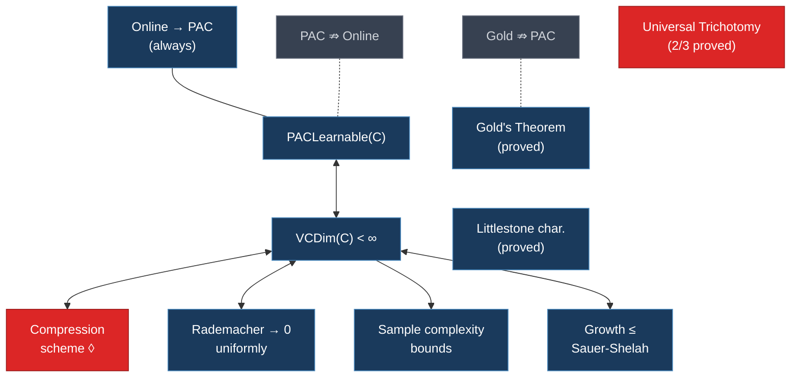
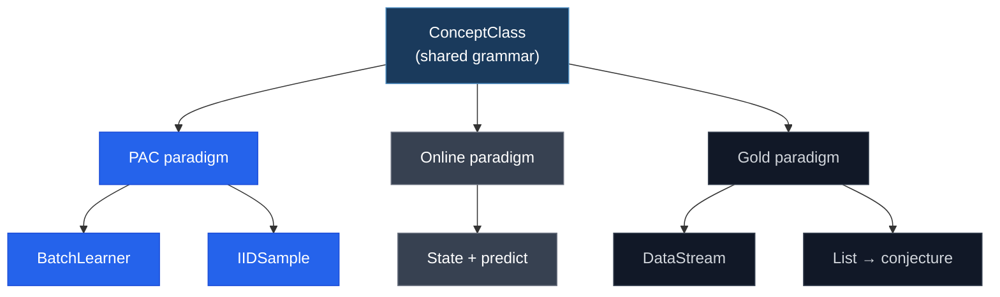
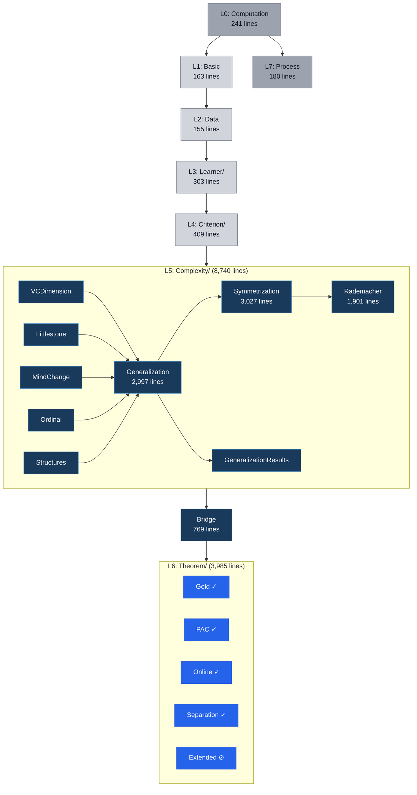
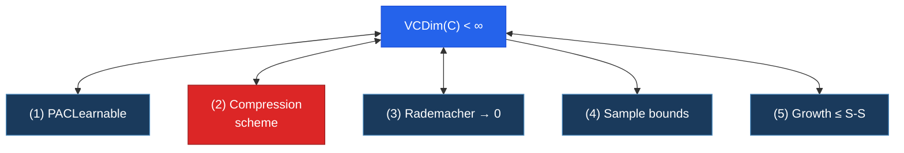
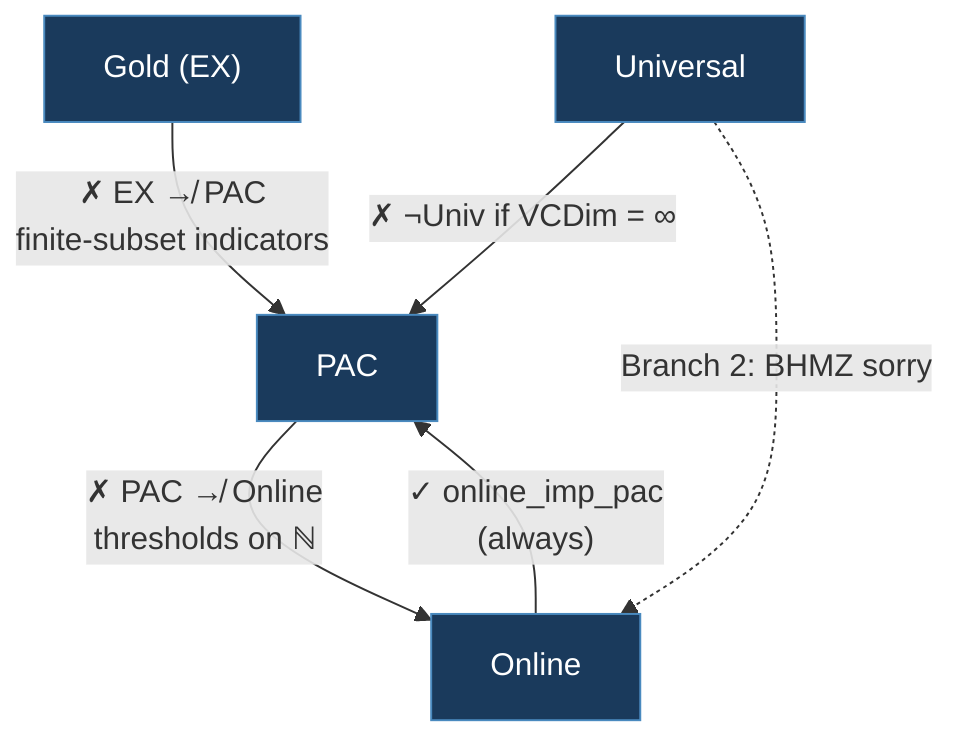
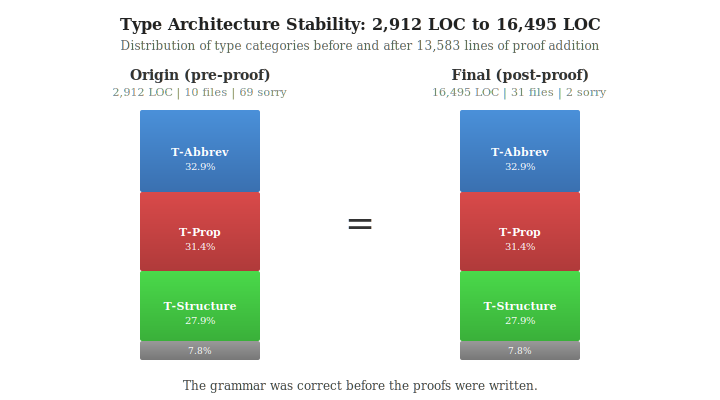

# Formal Learning Theory Kernel



```
◊ = forward direction blocked (Moran-Yehudayoff 2016)
⇏ = strict separation (constructive witness)
```

**31 files | 14,945 lines | 2 sorry | Lean 4 + Mathlib4**

A Lean4 formalization of the **Fundamental Theorem of Statistical Learning** (5-way equivalence, 4/5 conjuncts proved), the **Littlestone characterization** of online learnability, **Gold's theorem** on identification in the limit, all **paradigm separations** with constructive witnesses, and the **universal learning trichotomy** (2/3 branches proved). Built on Mathlib4.

The two remaining sorry tactics are blocked by Moran-Yehudayoff 2016 (compression conjecture) and Bousquet-Hanneke-Moran-Zhivotovskiy STOC 2021 (one-inclusion graph (a combinatorial construction on labeled samples)). Both require combinatorial infrastructure absent from Mathlib. They are the frontier, not engineering gaps.

This document presents the **structure of learning theory as revealed by formalization**: the type-theoretic break points, the proof asymmetries textbooks suppress, and the world model of theorem dependencies that emerges when one forces an entire field through a proof assistant.

---

## I. The Structure of Learning Theory

### The Paradigm Joints

Six decades of learning theory produced three paradigms that textbooks treat as chapters of one story. Formalization reveals they are three theories sharing vocabulary but not structure.



Each paradigm pair carries a binary **obstruction tag**: *obstructed* (the paradigms share vocabulary but no proof infrastructure transfers between them; cross-paradigm theorems require explicit bridges) or *independent* (the paradigms share vocabulary but never interact in any theorem).

| Pair | Tag | Evidence |
|------|-----|----------|
| PAC / Online | obstructed | `online_imp_pac` exists, but `pac_not_implies_online` proves the reverse fails |
| PAC / Gold | obstructed | `ex_not_implies_pac` proves Gold learnability does not entail PAC learnability |
| Online / Gold | independent | No theorem in this library connects them. No shared proof technique. |

This is **Break Point BP1**: no common learner parent type exists. A `BatchLearner` takes `{m : Nat} -> (Fin m -> X x Y) -> Concept X Y`. An `OnlineLearner` carries mutable `State` and processes instances one at a time. A `GoldLearner` takes `List (X x Y) -> Concept X Y`. No common parent captures all three without erasing the structural properties their theorems depend on.

The type system does not permit conflation. This is not a limitation. It is the mathematics.

### Seven Break Points

Formalization discovered 7 type-theoretic break points, locations where the mathematical structure forces incompatible Lean4 types. Five were predicted from paradigm analysis; two emerged during compilation.

| BP | Name | What breaks | Severity |
|----|------|-------------|----------|
| **BP1** | No common learner parent | `BatchLearner` / `OnlineLearner` / `GoldLearner` have incompatible signatures | Critical |
| **BP2** | `WithTop Nat` vs `Ordinal` | VC dimension lives in `WithTop Nat`; universal learning requires ordinals beyond omega | High |
| **BP3** | Data interface incompatibility | PAC uses i.i.d. measures, Online uses adversarial sequences, Gold uses enumerating streams | Critical |
| **BP4** | Function-class to set-family bridge | `ConceptClass X Bool` (functions) vs `Set (Set X)` (Mathlib). Lossless for `Bool`. Lossy for `|Y| > 2`. | Medium |
| **BP5** | Five bounds, five signatures | The 5-way fundamental theorem requires five different proof technologies to state | High |
| **BP6** | `ConceptClass` over-connected | 22 incoming edges, 4 counterdefinitions needed (decidable, RE, measurable, multiclass) | High* |
| **BP7** | Bayesian prior has no canonical type | `R`-valued vs `NNReal`-valued vs measure-valued. No single type serves all proof contexts. | Medium* |

*Discovered during typing, not predicted.

### The Dependency DAG



The infrastructure layers (L5) account for **58%** of the codebase. The theorems (L6) account for 27%. Definitions (L1-L4) account for 7%. This ratio is itself a datum about learning theory: the conceptual vocabulary is small, but the proof infrastructure connecting combinatorics to measure theory is vast.

### The shared axis

Every proof in this library answers one question: *How does finite combinatorial structure control infinite measure-theoretic objects?*

The VC dimension is a finite combinatorial quantity (largest shattered set). PAC learnability is a measure-theoretic property (probability over i.i.d. samples). The fundamental theorem says they are equivalent. The entire proof infrastructure exists to cross this bridge: Sauer-Shelah translates VCDim into growth function bounds (combinatorics to combinatorics), symmetrization translates growth bounds into uniform convergence (combinatorics to measure theory), and concentration inequalities translate uniform convergence into PAC guarantees (measure theory to measure theory).

The two sorry theorems sit on this same axis. Moran-Yehudayoff's compression theorem shows that finite VCDim implies a finite compression scheme (combinatorics to combinatorics, but the construction requires approximate minimax on binary matrices). BHMZ's (Bousquet-Hanneke-Moran-Zhivotovskiy) universal learning theorem shows that finite VCDim with infinite Littlestone dimension still permits learning (combinatorics to measure theory, but the construction requires one-inclusion graph aggregation).

There is no proof in this library that does not participate in this axis.

---

## II. The Fundamental Theorem

The central result, stated as `fundamental_theorem` in `Theorem/PAC.lean`:

> **Theorem** (5-way equivalence). *For a concept class* C *over a measurable space* X, *the following are equivalent:*
>
> 1. C *is PAC-learnable*
> 2. C *admits a finite compression scheme*
> 3. *The Rademacher complexity of* C *vanishes uniformly*
> 4. *The sample complexity of* C *is finitely bounded (with quantitative sandwich)*
> 5. *The growth function of* C *is bounded by Sauer-Shelah*
>
> *and all five are equivalent to* VCDim(C) < infinity.



**Status**: 4 of 5 conjuncts fully proved. The forward direction of conjunct 2 (VCDim finite implies compression scheme exists) requires Moran-Yehudayoff's 2016 construction, an approximate minimax argument on bounded-VC binary matrices that has no Mathlib infrastructure.

### The constructive / non-constructive asymmetry

The biconditional `PACLearnable ↔ VCDim < infinity` conceals a deep asymmetry:

- **Forward** (finite VCDim → PAC): **Constructive.** Produces an explicit ERM (Empirical Risk Minimization) learner. Routes through 3,000 lines of symmetrization infrastructure to establish uniform convergence.
- **Backward** (PAC → finite VCDim): **Non-constructive.** Constructs an adversarial hard distribution via contrapositive. The witness is a probability measure that cannot be computed from the learner.

This asymmetry is *unavoidable*. It is not an artifact of the proof strategy but a genuine structural feature of the characterization. The forward direction builds a learner; the backward direction proves one cannot exist.

---

## III. What Formalization Reveals That Textbooks Suppress

### 1. The No-Free-Lunch theorem is false for finite domains

Every standard textbook states a version of: "No learner can learn `Set.univ`." Formalization exposes that this claim, as typically stated, is **provably false** when the domain X is finite.

For finite X: `VCDim(Set.univ) = |X| < infinity`. By the fundamental theorem (forward direction), `Set.univ` *is* PAC-learnable. The learner is trivial: take m >= |X| samples and memorize.

The correct NFL (No-Free-Lunch) theorem requires **infinite X**, where `VCDim(Set.univ) = infinity`. The proof in `Theorem/PAC.lean` constructs this via `Function.extend` on `Subtype.val_injective`. For every finite S, every labeling of S is realized by some function in `Set.univ`, giving VCDim = infinity by `WithTop.eq_top_iff_forall_ge`.

This is not a pedantic point. It reflects a genuine structural divide: the boundary between learnable and unlearnable is not "all functions" vs "some functions" but "finite VC dimension" vs "infinite VC dimension." Cardinality of the hypothesis space is irrelevant.

### 2. Infinite domains double proof complexity

For **finite X**, the PAC learnability proof is direct:
- Hoeffding concentration on i.i.d. samples
- Union bound over finitely many hypotheses
- ~100 lines of Lean4

For **infinite X**, the same mathematical statement requires:
- **Ghost sample (independent copy of the training set) construction** (the double-sample trick)
- **Symmetrization** (exchanging order of expectation and supremum over uncountable C)
- **Exchangeability bounds** via `NullMeasurableSet` + Tonelli interchange
- **Growth function restriction** to reduce uncountable union to polynomial bound
- ~3,000 lines of Lean4

The textbook treatment occupies the same two paragraphs in both cases. The formalization reveals that the infinite-domain case is **30x harder** in proof infrastructure, because the symmetrization argument, invisible in informal mathematics, requires explicit construction of swap functions, product measure isomorphisms, and measurability witnesses for every intermediate step.

The fundamental theorem holds for ALL measurable spaces X. The proof splits via `rcases finite_or_infinite X`: the finite branch is trivial (enumerate all concepts, union bound), roughly 100 lines. The infinite branch requires the full symmetrization apparatus: 3,000 lines. The entire VC dimension theory, as a proof infrastructure, exists to handle the infinite case.

The direct union bound over uncountable concept classes gives 2^{2m}, which is vacuous. The Rademacher route succeeds because it takes suprema over finite sample restrictions, reducing the uncountable class to a polynomial-sized set of labelings. This is why Rademacher complexity appears in the formalization at all: not as a theoretical nicety, but as the only viable route through uncountable C.

The three irreducible layers of the symmetrization route:

```
Layer 3: Growth function restriction              ~400 lines
  GrowthFunction(C, 2m) bounds distinct labelings on 2m points.
  Reduces uncountable sup over C to finite union bound.
  Uses: sauer_shelah_exp_bound, growth_exp_le_delta
         │
         ▼
Layer 2: Ghost-sample symmetrization               ~1,200 lines
  Introduces independent copy S' of sample S.
  Exchanges sup and expectation via exchangeability.
  Pr[sup |gen - emp| ≥ ε] ≤ 2 · Pr[sup |emp' - emp| ≥ ε/2]
  Uses: symmetrization_step, double_sample_pattern_bound,
        finite_exchangeability_bound (NullMeasurableSet + Tonelli)
         │
         ▼
Layer 1: Concentration (Hoeffding)                  ~300 lines
  Per-hypothesis tail bound via sub-Gaussian MGF (moment generating function).
  Pr[emp_err - true_err ≥ t] ≤ exp(-2mt^2)
  Uses: hoeffding_one_sided, cosh_le_exp_sq_half,
        rademacher_mgf_bound
```

No layer can be removed. Layer 3 is needed because C may be uncountable. Layer 2 is needed because the sup over C does not commute with expectation. Layer 1 is needed because individual hypothesis errors are random variables requiring concentration.

### 3. Measure-theoretic regularity is non-negotiable

For uncountable concept classes, the "bad event"

{xs : Fin m -> X | exists h in C, |true_err(h) - emp_err(h)| >= eps}

is not `MeasurableSet`. This is stronger than "not automatically measurable": the sigma-algebra generated by the product measure genuinely does not contain the uncountable union. The standard Lean4/Mathlib integration API (`lintegral`, `integral`) requires measurability witnesses.

The resolution: `NullMeasurableSet` suffices. Integration via `lintegral_indicator_one₀` and `AEMeasurable.indicator₀` requires only almost-everywhere measurability, not pointwise. The formalization introduces `WellBehavedVC` as a regularity assumption: the bad event is null-measurable with respect to the product measure. This is not a formalization artifact. It is a mathematical condition that pen-and-paper proofs suppress by working with parametric or countable hypothesis classes implicitly. For uncountable C, the condition is non-trivial and must be stated.

### 4. The Littlestone tree definition has a subtle bug

The standard branch-wise definition of tree shattering:

```
isShattered C (.branch x l r) =
  (∃ c ∈ C, c x = true ∧ isShattered C l) ∧
  (∃ c ∈ C, c x = false ∧ isShattered C r)
```

does **not** restrict the concept class at recursive calls. Different witness concepts may appear at each tree level without path consistency. Under this definition, `C = {const_true, const_false}` gives `LittlestoneDim = infinity`, but C is trivially online-learnable with 1 mistake.

The corrected definition restricts C at each branch:

```
isShattered C (.branch x l r) =
  (∃ c ∈ C, c x = true) ∧ (∃ c ∈ C, c x = false) ∧
  isShattered {c ∈ C | c x = true} l ∧
  isShattered {c ∈ C | c x = false} r
```

The characterization theorem (`Theorem/Online.lean`) uses the corrected version. The original buggy definition is preserved in `Complexity/Littlestone.lean` with documentation.

### 5. Quantifier ordering in uniform convergence is load-bearing

The definition of uniform convergence uses:

```
∀ ε > 0, ∃ m₀, ∀ D (probability measure), ∀ m ≥ m₀, [UC bound ≤ ε]
```

This is **not** the same as:

```
∀ ε > 0, ∀ D, ∃ m₀, ∀ m ≥ m₀, [UC bound ≤ ε]
```

The first (used in this formalization) makes m₀ independent of D and c, which is essential, because `PACLearnable`'s sample size function `mf(ε, δ)` must be distribution-free. The second allows m₀ to depend on D, which makes `uc_imp_pac` unprovable.

Textbooks state both orders interchangeably. They are not interchangeable.

### 6. Bool is fundamentally special

The bridge between `ConceptClass X Bool` (our type: sets of functions) and `Set (Set X)` (Mathlib's type: set families) is a **bijection**: the map `c ↦ {x | c x = true}` is lossless for `Y = Bool`.

For `|Y| > 2`, this bridge is **lossy**. Multiple functions map to the same family of level sets. The entire formalization (every theorem, every bridge, every complexity measure) operates over `Bool`. This is not a simplification. It reflects the mathematical fact that binary classification is the unique setting where function-based and set-based approaches coincide.

### 7. Definition as proof technique

The standard mind change count records how many times a learner changes its hypothesis. It says nothing about whether the final hypothesis is correct. The backward direction of any characterization theorem ("few mind changes implies learning") must separately establish convergence to the right concept.

`MindChangeOrdinal` in `Complexity/MindChange.lean` takes a different approach. It returns a finite ordinal when the learner converges correctly with finitely many changes. It returns omega otherwise, for both non-convergent and wrong-limit learners. This single design choice collapses the backward direction to: "MindChangeOrdinal < omega implies, by definition, that the learner converges to the correct concept with finitely many changes." The definition IS the proof.

This pattern, encoding a theorem's conclusion into a definition's return type, has no standard name. It appears once in the kernel (for Gold-style learning) and nowhere in the textbook literature. Formalization forced it: Lean4's type system rewards definitions that make theorems structurally obvious.

### 8. The measurable inner event principle

When the target event is non-measurable, find a measurable event inside it with the same probability bound. Conclude by monotonicity.

This pattern appears twice in the kernel, in unrelated proof chains:

1. **Symmetrization** (`Complexity/Symmetrization.lean`): The union over uncountable C of "hypothesis h has generalization gap >= epsilon" is not measurable. Resolution: construct a `NullMeasurableSet` inner event via `MeasureTheory.measurable_measure_prod_mk_left`, then bound by measure monotonicity.

2. **Advice elimination** (`Theorem/Extended.lean`): The product-space success event `SuccessProd` (defined via `Classical.choose`) is not measurable. Resolution: construct `GoodPair`, a measurable inner event satisfying the same probability bound, then transport via monotonicity.

The principle has no pen-and-paper analogue. Measurability is invisible in informal mathematics. Formalization makes it load-bearing: without a measurability witness, `lintegral` and `integral` refuse to compute. The two instances were discovered independently (in different proof chains, weeks apart) and only recognized as the same pattern afterward.

---

## IV. Paradigm Separations: The Witness Constructions

Separation theorems prove that paradigm implications are strict. The constructions are explicit.



**PAC does not imply Online** (`pac_not_implies_online`): The witness is the threshold class on natural numbers, `C = {(· ≤ n) | n : Nat}`. VC dimension is 1, since only singletons are shattered (thresholds are monotone). Littlestone dimension is infinite: an adversary binary-searches the threshold by querying midpoints, forcing one mistake per query at every depth. The proof constructs the adversary strategy explicitly via induction on tree depth.

**EX (identification in the limit) does not imply PAC** (`ex_not_implies_pac`): The witness is finite-subset indicators on natural numbers. The Gold learner outputs "true on everything seen so far" and converges because every finite concept eventually stabilizes. But every finite subset of natural numbers is shattered, giving VCDim = infinity.

**Online implies PAC** (`online_imp_pac`): The only non-strict separation. Any online learner with mistake bound M gives a PAC learner with sample complexity polynomial in M, 1/epsilon, and 1/delta. The proof routes through the generalization bound from finite Littlestone dimension.

---

## V. The Proof World Model

### Load-bearing vs routine

| Component | LOC | Load-bearing? | Why |
|-----------|-----|---------------|-----|
| Symmetrization infrastructure | 3,027 | **Yes** | Irreducible for infinite-X uniform convergence. Three layers: Hoeffding, ghost-sample symmetrization, growth function restriction. |
| Rademacher infrastructure | 1,901 | **Yes** | Massart's lemma, MGF bounds, VCDim-Rademacher connection. Self-contained chain (does not need symmetrization). |
| NFL core counting | ~200 | **Yes** | Per-sample adversarial construction + product measure positivity. Cannot be simplified. |
| Littlestone characterization | 690 | **Yes** | Corrected tree definition + version space potential argument. Non-constructive at each decision step. |
| Sauer-Shelah bridge | ~100 | Routine | Connects to Mathlib's `Finset.vcDim`. |
| Hoeffding bounds | ~300 | Routine | Concentration inequality infrastructure from Mathlib. |
| Occam's algorithm | ~50 | Routine | Follows immediately from the VCDim gate. |

### Critical path to the fundamental theorem

```
fundamental_theorem
├── vc_characterization ←──── vcdim_finite_imp_pac
│                                  └── vcdim_finite_imp_uc'  [3027 lines, sorry-free]
│                                        ├── symmetrization_uc_bound
│                                        │     ├── hoeffding_one_sided
│                                        │     ├── symmetrization_step
│                                        │     └── finite_exchangeability_bound
│                                        └── growth_exp_le_delta
│                                              └── sauer_shelah_exp_bound
├── pac_imp_vcdim_finite ←──── vcdim_infinite_not_pac
│                                  └── nfl_core [counting argument]
├── fundamental_vc_compression
│   ├── compression_imp_vcdim_finite ← [pigeonhole, proved]
│   └── vcdim_finite_imp_compression ← [SORRY: Moran-Yehudayoff 2016]
├── fundamental_rademacher ←── vcdim_finite_imp_rademacher_vanishing
│                                  └── [self-contained chain, 1901 lines]
└── growth_bounded_imp_vcdim_finite / vcdim_finite_imp_growth_bounded
```

### Quantitative profile

| Metric | Count |
|--------|-------|
| Theorem/lemma statements | 210 |
| Definitions | 157 |
| Structures | 46 |
| Total lines | 14,945 |
| Sorry tactics | 2 |
| Files | 31 |
| Mathlib bridges | 5 (ConceptClass ↔ Set, Shatters ↔ Finset.Shatters, VCDim ↔ Finset.vcDim, IIDSample ↔ Measure.pi, WithTop Nat ↔ Ordinal) |
| Paradigms formalized | 5 with proved theorems (PAC, Online, Gold, Universal, Bayesian); 1 with definitions only (Query) |
| Break points | 7 |
| Maximum dependency chain depth | 7 (Concept → VCDim → fundamental_theorem) |
| Maximum fan-in node | ConceptClass (22 incoming edges) |

### Proof techniques

The library uses 8 distinct proof methods. Their distribution across the codebase is not uniform.

| Method | Paradigm | Where used | Frequency |
|--------|----------|-----------|-----------|
| **Contrapositive** | PAC | `pac_imp_vcdim_finite`, `nfl_theorem_infinite`, `rademacher_vanishing_imp_pac` | 12 theorems |
| **Symmetrization** (ghost sample) | PAC | `symmetrization_step`, `symmetrization_uc_bound`, `vcdim_finite_imp_uc'` | 5 theorems, ~3000 LOC |
| **Adversary construction** | PAC, Online | `pac_not_implies_online`, `adversary_threshold`, `nfl_core` | 6 theorems |
| **Potential function** | Online | `backward_direction` (SOA, Standard Optimal Algorithm), `ldim_versionSpace_le` | 3 theorems |
| **Pigeonhole** | PAC | `compression_imp_vcdim_finite`, `compress_injective_on_labelings` | 4 theorems |
| **Concentration inequality** | PAC | `hoeffding_one_sided`, `chebyshev_seven_twelfths_bound`, `rademacher_mgf_bound` | 8 theorems |
| **Induction on tree depth** | Online | `forward_direction`, `backward_direction`, `adversary_threshold` | 5 theorems |
| **Locking sequence (an enumeration strategy that forces convergence)** | Gold | `gold_theorem` | 1 theorem |

No proof method is shared across all three paradigms. PAC theorems use concentration inequalities and symmetrization. Online theorems use potential functions and tree induction. Gold's theorem uses a locking sequence that appears nowhere else in the library. The shared mathematical axis (Section I) is answered by completely disjoint proof technologies. This is not an artifact of the formalization: the data presentations are incompatible (i.i.d. samples vs. adversarial sequences vs. enumerating streams), and incompatible data presentations force incompatible proof methods.

### Formalization techniques

| Technique | Where used | What it solves |
|-----------|-----------|---------------|
| 7/12-fraction Chebyshev | `boost_two_thirds_to_pac` | Integer threshold in majority-vote boosting |
| Doubled-count trick | Markov bounds in ℕ | Half-integer threshold avoidance |
| Three-step pullback | Product-space transport | One map at a time, not full event |
| Set-equality bridge | Binder-type gaps | Non-reducing functions in lambda terms |
| Nat.pair encoding | Sample splitting | Avoids dependent types in learner signature |
| finite_exchangeability_bound | Symmetrization | NullMeasurableSet Tonelli lemma |

### Key Mathlib dependencies

| Mathlib component | Role in this library |
|------------------|---------------------|
| `MeasureTheory.Measure.pi` | i.i.d. product measure for PAC sample spaces |
| `Finset.vcDim` + `card_le_card_shatterer` | Sauer-Shelah lemma (bridged via `Bridge.lean`) |
| `SetTheory.Ordinal.Arithmetic` | Ordinal VC dimension and mind change ordinals |
| `MeasureTheory.Integral.Bochner` | Expected values in Rademacher and generalization bounds |
| `Computability.TuringMachine` | Computation infrastructure (L0 layer) |

---

## VI. The Two Remaining Sorrys

| File | Theorem | Blocked by | Citation | Role |
|------|---------|-----------|----------|------|
| `Complexity/Generalization.lean` | `vcdim_finite_imp_compression` | Approximate minimax on bounded-VC binary matrices | Moran-Yehudayoff 2016 (arXiv:1503.06960) | Forward direction of conjunct 2 |
| `Theorem/Extended.lean` | `bhmz_middle_branch` | One-inclusion graph learners + doubling aggregation | Bousquet-Hanneke-Moran-Zhivotovskiy, STOC 2021 | Branch 2 of universal trichotomy |

Both are blocked by deep combinatorial constructions with no Mathlib infrastructure. The Moran-Yehudayoff compression theorem has been open in some form since Littlestone and Warmuth's 1986 conjecture; the best known bound is 2^{O(d)}. The BHMZ universal learning construction requires ordinal analysis and tree-based aggregation schemes.

These are not engineering gaps. They are the frontier.

---

## VII. The Discovery DAG: Proof Structure with Counterfactual Branches

The following diagram renders the full theorem dependency structure of this library. Solid arrows are proved dependencies. Dashed arrows with **X** marks are **counterfactual branches**: dead-end proof routes that were explored and killed by specific discoveries during formalization. Each counterfactual branch records the intervention that killed it and what was discovered.

The counterfactual branches are the most informative part of this diagram. They show where the proof *could not* go, and why. Proving that a route is dead is a discovery of the same order as proving a theorem.

```mermaid
flowchart TB
    classDef core fill:#1a365d,stroke:#2c5282,color:#fff
    classDef measure fill:#2b6cb0,stroke:#3182ce,color:#fff
    classDef infra fill:#4299e1,stroke:#63b3ed,color:#fff
    classDef foundation fill:#2d3748,stroke:#4a5568,color:#e2e8f0
    classDef sorry fill:#c53030,stroke:#e53e3e,color:#fff
    classDef dead fill:#a0aec0,stroke:#718096,color:#2d3748,stroke-dasharray:5 5

    %% ════════════════════════════════════
    %% LAYER 0: FOUNDATIONS
    %% ════════════════════════════════════
    subgraph L0[" "]
        direction LR
        CC["ConceptClass X Bool"]:::foundation
        BL["BatchLearner"]:::foundation
        OL["OnlineLearner"]:::foundation
        GL["GoldLearner"]:::foundation
        Mpi["Measure.pi"]:::foundation
        BRIDGE["Bridge: Bool bijection"]:::foundation
    end

    %% ════════════════════════════════════
    %% LAYER 1: COMPLEXITY MEASURES
    %% ════════════════════════════════════
    subgraph L1[" "]
        direction LR
        VCD["VCDim C < ∞"]:::core
        LD["LittlestoneDim C < ∞"]:::core
        MCO["MindChangeOrdinal"]:::core
    end

    %% ════════════════════════════════════
    %% LAYER 2: PROOF INFRASTRUCTURE
    %% ════════════════════════════════════
    subgraph L2[" "]
        direction LR
        SS["Sauer-Shelah · Mathlib"]:::infra
        GF["GrowthFunction"]:::measure
        RAD["Rademacher → 0"]:::measure
        CS["CompressionScheme"]:::measure
        NFL["NFL counting · 200 LOC"]:::measure
    end

    subgraph L2b[" "]
        direction LR
        WB["WellBehavedVC"]:::core
        UC["Uniform Convergence · ∃ m₀, ∀ D"]:::measure
    end

    subgraph L2c[" "]
        direction LR
        SYM["Symmetrization · 3,027 LOC"]:::measure
        HOE["Hoeffding · 300 LOC"]:::infra
        BOOST["Boosting · Chebyshev"]:::measure
    end

    %% ════════════════════════════════════
    %% LAYER 3: CHARACTERIZATIONS
    %% ════════════════════════════════════
    subgraph L3[" "]
        direction LR
        VCC["vc_characterization · PAC ↔ VCDim < ∞"]:::core
        LC["littlestone_char · Online ↔ LDim < ∞"]:::core
        GT["gold_theorem · locking"]:::core
    end

    %% ════════════════════════════════════
    %% LAYER 4: SEPARATIONS
    %% ════════════════════════════════════
    subgraph L4[" "]
        direction LR
        OIP["online_imp_pac"]:::core
        PNO["pac ⇏ online · thresholds"]:::core
        ENP["ex ⇏ pac · finite subsets"]:::core
        NFLI["nfl_theorem_infinite"]:::core
    end

    %% ════════════════════════════════════
    %% LAYER 5: SUMMIT THEOREMS
    %% ════════════════════════════════════
    subgraph L5[" "]
        direction LR
        FT["FUNDAMENTAL THEOREM · 5-way equivalence"]:::core
        UT["universal_trichotomy · 2/3 proved"]:::sorry
    end

    %% ════════════════════════════════════
    %% SORRY NODES
    %% ════════════════════════════════════
    subgraph SBLOCK[" "]
        direction LR
        COMP_FWD["SORRY: vcdim_finite_imp_compression
        Moran-Yehudayoff 2016"]:::sorry
        BHMZ["SORRY: bhmz_middle_branch
        BHMZ STOC 2021"]:::sorry
    end

    %% ════════════════════════════════════
    %% EDGES: LAYER 0 → 1
    %% ════════════════════════════════════
    CC --> VCD
    CC --> LD
    CC --> MCO

    %% ════════════════════════════════════
    %% EDGES: LAYER 1 → 2
    %% ════════════════════════════════════
    VCD --> SS
    VCD --> RAD
    VCD --> CS
    VCD --> UC
    BRIDGE --> SS
    SS --> GF
    Mpi --> NFL
    Mpi --> UC

    %% ════════════════════════════════════
    %% EDGES: LAYER 2 → 2 (internal)
    %% ════════════════════════════════════
    WB --> SYM
    UC --> SYM
    SYM --> HOE
    SYM --> GF

    %% ════════════════════════════════════
    %% EDGES: LAYERS 1-2 → 3
    %% ════════════════════════════════════
    VCD --> VCC
    LD --> LC
    MCO --> GT
    BL --> VCC
    OL --> LC
    GL --> GT

    %% ════════════════════════════════════
    %% EDGES: LAYER 3 → 4
    %% ════════════════════════════════════
    LC --> OIP
    VCD --> PNO
    LD --> PNO
    NFL --> NFLI
    VCC --> NFLI

    %% ════════════════════════════════════
    %% EDGES: LAYERS 2-4 → 5
    %% ════════════════════════════════════
    VCC --> FT
    CS --> FT
    RAD --> FT
    GF --> FT
    COMP_FWD --> CS
    VCC --> UT
    LC --> UT
    BOOST --> UT
    BHMZ --> UT

    %% ════════════════════════════════════
    %% COUNTERFACTUAL BRANCHES
    %% ════════════════════════════════════
    CF1["✗ NFL for finite X
    provably false"]:::dead
    CF1 -.-> NFLI

    CF2["✗ BranchWise LDim
    no path consistency"]:::dead
    CF2 -.-> LC

    CF3["✗ Direct union bound
    gives 2^2m, not GF"]:::dead
    CF3 -.-> UC

    CF4["✗ UC without regularity
    bad event not measurable"]:::dead
    CF4 -.-> SYM

    CF5["✗ PAC with ∃ Dm
    trivially true"]:::dead
    CF5 -.-> VCC

    CF6["✗ D-dependent m₀
    not distribution-free"]:::dead
    CF6 -.-> UC

    CF7["✗ Bridge for |Y| > 2
    Bool-specific bijection"]:::dead
    CF7 -.-> BRIDGE
```

<div style="overflow-x: auto; overflow-y: auto; max-height: 900px; border: 1px solid #d1d5db; border-radius: 6px; padding: 8px;">
  
</div>

<!-- Original Mermaid source preserved below for reference

-->

### Reading the counterfactual branches

Each dashed node represents a proof route that was explored and killed. The annotation describes what was discovered:

| # | Intervention | What was discovered | Effect on DAG |
|---|-------------|---------------------|---------------|
| 1 | **NFL for finite X** | Statement is provably false for finite domains | Killed: memorizer learns Set.univ when X is finite. Correct NFL requires infinite X. |
| 2 | **BranchWise Littlestone** | Definition does not restrict C at recursive calls | Killed: characterization theorem is false under the branch-wise definition. Corrected to path-wise. |
| 3 | **Direct union bound** | Bound gives 2^{2m}, not GrowthFunction(C,2m) | Killed: three separate proof attempts confirmed the route is dead. Symmetrization is necessary. |
| 4 | **UC without regularity** | Bad event not measurable for uncountable C | Repaired: introduced WellBehavedVC as regularity gate. NullMeasurableSet suffices for integration. |
| 5 | **PAC with existential Dm** | Existential Dm makes PACLearnable trivially true | Killed: Dm depends on target concept c via memorizer + point mass. Fixed to Measure.pi (distribution-free). |
| 6 | **UC with D-dependent m0** | Sample complexity function cannot depend on D | Repaired: m0 must be distribution-free for PACLearnable's quantifier structure. Fixed quantifier ordering. |
| 7 | **Bridge for general Y** | Bijection is Bool-specific | Boundary: for |Y| > 2, multiple functions map to the same level-set family. All results require Y = Bool. |

Interventions 1, 3, and 5 killed provably false statements. Interventions 2, 4, and 6 repaired definitions or added hypotheses to rescue viable routes. Intervention 7 established a setting-specific boundary: the library's results hold for binary classification, and the restriction is mathematically necessary.

The counterfactual branches collectively explain why the library has the shape it does. The NFL correction (1) explains why all NFL theorems require `[Infinite X]`. The Littlestone fix (2) explains why `Theorem/Online.lean` defines its own `LTree.isShattered` rather than using `Complexity/Littlestone.lean`. The symmetrization necessity (3) explains why 58% of the codebase is infrastructure. The WellBehavedVC introduction (4) explains the regularity hypothesis that appears in every measure-theoretic theorem. The PAC repair (5) explains why `Measure.pi` appears in the definition rather than an existential. The quantifier fix (6) explains the specific quantifier ordering in `HasUniformConvergence`. The Bool boundary (7) explains why the entire library operates over `Bool`.

---

## VIII. Premise Evolution: From Textbook to Kernel

The type architecture began as a derivation from informal learning theory (the author's textbook). Formalization forced modifications. Some were mathematical discoveries (the textbook was wrong). Others were forced by Mathlib's current state. The premise-evolution DAG shows which.

<div style="overflow-x: auto; overflow-y: auto; max-height: 1000px; border: 1px solid #d1d5db; border-radius: 6px; padding: 8px;">
  
</div>

Six of ten core types were modified during formalization. Of these, five were mathematical discoveries (the original definitions were provably inadequate) and one was forced by Mathlib's ordinal/VC dimension API. No type was added that was not in the original premise. The grammar was complete; it was the definitions that needed correction.

---

## IX. Methodology

Built in **7 days** (March 18-25, 2026) using **Claude Code (Opus 4.6)** guided by an epistemological framework for AI-assisted formalization.

### The premise

Before proof discovery began, a **type architecture premise** was derived: 42 concept nodes across 8 layers (L0-L7), with explicit paradigm joints, obstruction tags, break points, and compilation constraints. This premise, recorded in `premise/origin.json`, defined the typed hypothesis space within which proof search operated.

The premise served as a **grammar** for the AI: instead of jointly discovering types and proofs (which produces trivially-true theorems, sorry-in-Prop, and type homogeneity), the AI searched for proofs within a well-scoped, pre-validated type structure.

### The delta

| | Before (origin) | After (final) |
|-|-----------------|---------------|
| Lines | 2,912 | 14,945 |
| Files | 10 monolithic | 31 modular |
| Sorry count | 69 | 2 |
| Break points resolved | 0 | 3 (BP2, BP4, BP5) |
| Break points confirmed | 0 | 2 (BP1, BP3) |

**Without the framework**, Claude closed 8 of 67 open proofs correctly (and 12 more trivially/vacuously). The dominant failure mode was **adding new sorrys faster than closing existing ones** and **attacking only the easiest proofs** (trivial computation lemmas).

**With the framework**, 65 of 67 were closed. The remaining 2 are blocked by results absent from Mathlib, not by AI capability.

### Type architecture stability

The type distribution across the kernel remained constant through 12,033 lines of proof addition:

<p align="center">
  
</p>

Abbreviations, propositions, and structures held at 32.9%, 31.4%, and 27.9% respectively in both the origin premise (2,912 LOC) and the final kernel (14,945 LOC). The proof infrastructure redistributed across layers (L5 Complexity grew from a stub to 8,740 lines), but the balance of type categories did not change. The pre-designed grammar absorbed the proofs without architectural modification.

Both the origin and final type architectures are recorded in `premise/origin.json` and `premise/final.json`.

### Discovery process

The full discovery process (10,000+ recorded tactics, 74 reasoning traces, error mode analysis) is documented in the [companion discovery repository](https://github.com/Zetetic-Dhruv/formal-learning-theory-discovery).

---

## X. Building

```bash
lake build   # Requires elan. First build fetches Mathlib (~20 min).
```

Lean `v4.29.0-rc6` | Mathlib4 from `master`

---

## XI. Companion Repositories

This kernel is one component of a larger programme. The four public companion repositories:

| Repository | Role | Relationship to this repo |
|-----------|------|--------------------------|
| [formal-learning-theory-discovery](https://github.com/Zetetic-Dhruv/formal-learning-theory-discovery) | Discovery process: 74 reasoning traces, metakernel, 10,000+ exploration paths | Documents *how* this kernel was built |
| [formal-learning-theory-dataset](https://github.com/Zetetic-Dhruv/formal-learning-theory-dataset) | Structured concept graph (142 nodes, 260 edges) + fine-tuned SLM | The concept graph that informed the type architecture in `premise/origin.json` |
| [formal-learning-theory-book](https://github.com/Zetetic-Dhruv/formal-learning-theory-book) | *A Textbook of Formal Learning Theory* (202 pages, 18 chapters) | Informal exposition of the same mathematical content |
| [First-Proof-Benchmark-Results](https://github.com/Zetetic-Dhruv/First-Proof-Benchmark-Results) | Empirical analysis of AI-driven proof discovery across frontier models | Broader context: proof discovery benchmarks beyond this library |

---

## XII. Citation

```bibtex
@software{gupta2026flt_kernel,
  author       = {Gupta, Dhruv},
  title        = {Formal Learning Theory Kernel: {Lean4} Formalization
                  of the Fundamental Theorem of Statistical Learning},
  year         = {2026},
  url          = {https://github.com/Zetetic-Dhruv/formal-learning-theory-kernel},
  note         = {31 files, 14{,}945 LOC, 2 sorry.
                  Proof discovery via Claude Opus 4.6.}
}

@software{gupta2026flt_discovery,
  author       = {Gupta, Dhruv},
  title        = {Formal Learning Theory Discovery: Empirical Analysis
                  of {AI}-Guided Proof Search},
  year         = {2026},
  url          = {https://github.com/Zetetic-Dhruv/formal-learning-theory-discovery},
  note         = {74 reasoning traces, 10{,}000+ exploration paths.}
}

@software{gupta2026flt_book,
  author       = {Gupta, Dhruv},
  title        = {A Textbook of Formal Learning Theory},
  year         = {2026},
  url          = {https://github.com/Zetetic-Dhruv/formal-learning-theory-book},
  note         = {202 pages, 18 chapters.}
}
```

---

## XIII. Attribution

Copyright (c) 2026 Dhruv Gupta. Apache 2.0.

Proof discovery was conducted using Claude Opus 4.6 (Anthropic) via Claude Code, guided by an epistemological framework for structured AI-assisted formalization. The type architecture, proof scoping, error correction, and all editorial decisions are the author's.
