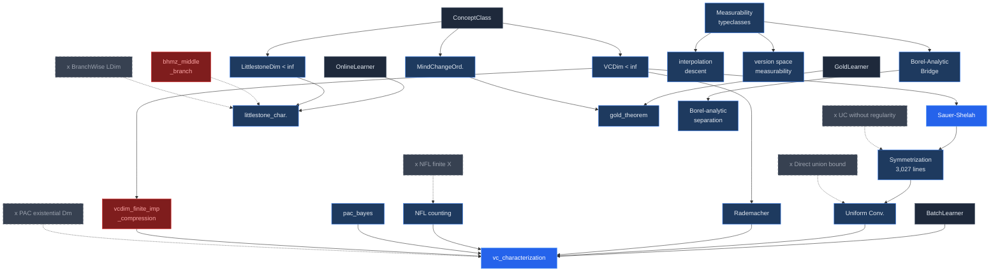

# Section X — FINAL DRAFT

---

## X. The Discovery DAG

The dependency structure of the kernel is encoded in the Mermaid diagram below. Solid edges are proved dependencies. Dashed nodes are counterfactual branches: proof routes that were explored and killed. Each dead branch records a specific discovery: a definition that was provably inadequate, a proof route that was provably blocked, or a setting boundary that was provably strict.

The counterfactual branches collectively explain why the kernel has the shape it does.

### Reading the counterfactual branches

| Dead branch | What was discovered | Effect on the kernel |
|------------|--------------------|--------------------|
| NFL for finite X | VCDim(Set.univ) = \|X\| for finite X; memorizer learns Set.univ | All NFL theorems require `[Infinite X]` |
| BranchWise Littlestone | const_true/const_false gives LDim = infinity for a 1-mistake class | `Theorem/Online.lean` defines path-wise `LTree.isShattered` |
| Direct union bound | Produces 2^{2m}, not GrowthFunction(C, 2m) | 56% of the codebase is symmetrization infrastructure |
| UC without regularity | Bad event not measurable for uncountable C | `WellBehavedVC` regularity hypothesis in every measure-theoretic theorem |
| PAC with existential Dm | Existential Dm depends on target c via memorizer | `Measure.pi` (distribution-free) in the PACLearnable definition |
